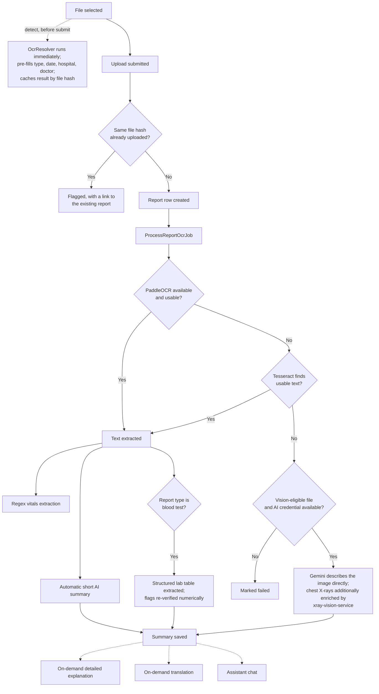

# Novix

Novix is a family health record manager. It gives a household a single place to store, understand, and act on every family member's medical history — lab reports, prescriptions, medications, vitals, allergies, and emergency information — instead of scattered paper files and phone photos.

Every family member is represented as their own record with two possible modes: a linked member who has their own login (the account owner, or anyone they've invited who accepted), or a dependent member with no login of their own (a child, an elderly parent) whose records the primary account manages directly. Two independent adult accounts can also link to each other and share access on their own terms.

Novix is not a medical device. It organizes, extracts, and explains records for convenience. Every AI-generated summary carries a disclaimer and is never presented as a diagnosis. It does not replace a qualified doctor.

## Contents

- [System overview](#system-overview)
- [Features](#features)
- [Tech stack](#tech-stack)
- [Report processing pipeline](#report-processing-pipeline)
- [Other pipelines](#other-pipelines)
- [Database schema](#database-schema)
- [Project structure](#project-structure)
- [Application routes](#application-routes)
- [Getting started](#getting-started)
- [Deployment](#deployment)
- [Testing](#testing)
- [Security and privacy](#security-and-privacy)
- [Roadmap](#roadmap)
- [License](#license)

## System overview

Novix runs as three deployed services:

- **novix-web** — the main Laravel application: authentication, family management, report storage, medications, vaccinations, the health timeline, sharing, the emergency card, the admin dashboard, and the AI assistant.
- **xray-vision-service** — a standalone Python service running a pretrained TorchXRayVision DenseNet classifier. Called only for `xray`-type reports, to enrich the AI-generated description with real model-estimated pathology probabilities.
- **clinical-nlp-service** — a standalone Python service running PaddleOCR (the primary OCR engine) and scispaCy/medspaCy (biomedical entity recognition — drug and diagnosis mentions, with negation detection).

Both Python services are optional from the main application's point of view: every call to them is wrapped so that if a service is unreachable, misconfigured, or returns an error, Novix falls back to its next-best option automatically rather than failing the request. Nothing about report processing depends on either service being available.

## Features

### Identity and family structure

Registration asks only for full name, email, password, phone number, and gender. Everything else — date of birth, blood group, photo, address, height and weight, emergency contact — is optional and can be filled in later from the profile pages. Sign-in supports Google OAuth or email and password; a new Google identity is only written to the database once registration completes, so an abandoned sign-up never leaves a half-created account.

A primary account can add dependents (no login of their own) or invite an independent adult by email. If the person being invited already has their own Novix account, acceptance creates a reciprocal sharing grant instead of colliding with their existing profile — both sides see the connection and can revoke it independently. Every invited person chooses their own sharing scope: full access, reports only, or summary only.

The dashboard shows a family-member switcher, a BMI trend, recent reports with AI summaries, today's medications, and quick-action tiles. A first-run checklist walks a new account through its first real actions, computed from actual data rather than a fixed flag. Dark mode is persisted server-side per user, so it follows the account across devices.

### Reports, OCR, and AI

Reports can be uploaded as PDF, Word, or image files (JPG, PNG, WEBP, TIFF, BMP, GIF), individually or in batches, via drag-and-drop, file picker, or camera capture. The moment a file is selected — before the form is even filled in — it is read in the background and used to pre-fill the report type, date, hospital, and doctor fields; a manually edited field is never overwritten. Re-uploading the exact same file (matched by content hash, not filename) is caught and flagged rather than silently duplicated.

Text extraction tries PaddleOCR first (via clinical-nlp-service), since it is generally more accurate than Tesseract on real-world uploads — phone photos, skewed scans, mixed layouts. If PaddleOCR is unavailable or finds nothing usable, Tesseract runs as a fallback (pages of a multi-page PDF processed concurrently, images preprocessed for grayscale/contrast/deskew/despeckle, garbled reads retried at 90/180/270 degree rotation). If neither engine finds any usable text at all — the common case for a raw scan image with no embedded text, such as an X-ray, sonography, or MRI film — the file is instead described directly by a vision-capable AI model. For chest X-rays specifically, that description is additionally grounded with real classifier output from xray-vision-service.

Once text is available, an automatic two-to-three sentence AI summary is generated. For blood test reports specifically, the full lab table (test name, result, unit, reference range, and a normal/low/high/borderline flag) is parsed into a structured table rather than lost inside a paragraph; the flag on each row is independently re-derived from a direct numeric comparison against the reference range whenever possible, rather than trusting the model's own arithmetic. Where a family member has two or more historical values for the same metric, a trend chart is shown on the report page. Extracted lab values also feed a lightweight regex-based extractor that populates structured vitals (blood pressure, blood sugar, HbA1c, cholesterol, hemoglobin) with no AI cost.

Everything beyond the automatic summary is on demand: a fuller, plain-language detailed explanation with doctor-discussion questions; translation of the summary between English, Hindi, and Gujarati (each language translated once and cached); and a per-family-member AI assistant chat that answers questions from that person's actual records. Every AI call routes through a single client that tries up to three Gemini API keys and then Groq as a last resort, so one key hitting its usage limit does not take AI features down.

### Medications and vaccinations

Medications support dosage, frequency, multiple reminder times per day, a start and end date range, and a per-medication reminder toggle. A daily job generates each day's pending dose slots; a recurring sweep sends a reminder email around each scheduled time and marks a dose missed after a grace period if nobody acted on it. Vaccinations track dose number, date administered, and next-due date, with a daily reminder email for anything due within a week or already overdue.

### Sharing and emergency access

A public emergency card page — reachable by scanning a real QR code, no login required — shows photo, computed age, blood group, allergies, active conditions and medications, and a tap-to-call emergency contact. Deactivating it hides everything immediately. Wallet-sized and full-page PDF versions are available, with the same QR code embedded, meant to be printed and carried.

Individual reports or a family member's full history can be shared via a link that always expires (24 hours, 48 hours, 7 days, or a custom date — there is no "never expires" option), with an optional four-digit PIN and an optional one-time-view mode that revokes itself immediately after the first open. Every share ever created is listed with its live status, view count, and a one-click revoke.

### Timeline and administration

The health timeline merges reports, medications, vaccinations, and vitals into one chronological feed with filtering, full-text search, and a compare-over-time view. A date range can be exported as a PDF summary suitable for a first consultation with a new doctor.

An administrative dashboard, gated behind an `is_admin` flag on a single account, provides read-only charts and metrics plus a generic table browser (create, edit, delete, CSV export) across the schema, for operational use rather than end-user access.

Sensitive actions — account creation, invitations, sharing grants and revokes, card reissues, share views, and every sign-in attempt — are written to an append-only audit log.

## Tech stack

| Layer | Technology |
|---|---|
| Language | PHP 8.4 |
| Backend framework | Laravel 11 |
| Database | MySQL |
| Queue | Laravel queues, database driver |
| Auth scaffolding | Laravel Breeze (Blade stack) |
| OAuth | Laravel Socialite (Google) |
| Primary OCR | PaddleOCR (Python, via clinical-nlp-service) |
| Fallback OCR | Tesseract, run as concurrent OS processes per page |
| Vision-only fallback | Google Gemini (multimodal), for images with no extractable text |
| Chest X-ray classifier | TorchXRayVision (pretrained DenseNet121), via xray-vision-service |
| Biomedical entity recognition | scispaCy / medspaCy, via clinical-nlp-service |
| PDF rasterization | Imagick + Ghostscript |
| AI providers | Google Gemini REST API (up to three keys) with Groq as a fallback |
| Outbound email | Resend |
| PDF generation | barryvdh/laravel-dompdf |
| QR codes | simplesoftwareio/simple-qrcode |
| Charts | ApexCharts |
| Interactivity | Alpine.js |
| CSS framework | Tailwind CSS |
| Build tool | Vite |
| Location data | country-state-city |
| Progressive Web App | Web app manifest, service worker, install prompt |

Model-level validation runs on every save via a shared trait, so invalid data cannot reach the database even if a caller bypasses form-request validation. Every PDF and QR code is produced by two shared services rather than each feature implementing its own. AI usage is cost-gated by design: only the short automatic summary runs without a user click; everything else is on demand and cached where re-viewing something already generated should not spend usage twice.

## Report processing pipeline



## Other pipelines

**AI provider fallback.** Every AI feature calls a single client that tries each configured Gemini key in order, then Groq, then retries the whole chain once more before giving up. A credential that just failed is skipped for a cooldown window rather than retried on every call.

**Medication and vaccination reminders.** A daily job creates each day's pending dose rows. A recurring job sends a reminder email for any dose due soon and marks overdue doses missed. A separate daily job emails vaccination reminders for anything due within a week or already overdue. All scheduling runs on the application's configured timezone (Asia/Kolkata by default), not UTC.

**Emergency card and report sharing.** Both features are built on the same two shared services — a QR code service and a PDF export service — so a QR code and a PDF are never implemented twice. A share or card view checks active status, expiry, and revocation before rendering; a one-time-view share revokes itself immediately after its first successful view.

## Database schema

The domain schema is organized into five areas: identity and family structure (users, family members, invitations); health profile (allergies, chronic conditions, vaccinations, doctors); reports, vitals, and AI processing (reports, BMI logs, health metrics, AI job and response history, chat messages); medications (medications, medication logs); and sharing, identity cards, and compliance (shares, ID cards, consents, audit log, sharing permissions, insurance policies). Foreign keys use deliberate cascade rules — tables holding real medical history restrict deletion of their parent family member row, so a routine edit can never silently destroy medical history; a full account deletion explicitly cascades through every dependent table in the correct order instead.

## Project structure

```
novix/
├── app/
│   ├── Console/Commands/          Scheduled jobs: medication logs, reminders,
│   │                               vaccination reminders, invitation expiry
│   ├── Http/Controllers/
│   │   ├── Auth/                  Login, Google OAuth, registration
│   │   ├── Admin/                 Admin dashboard and table browser
│   │   ├── Concerns/               Shared traits (active family member resolution)
│   │   ├── DashboardController.php
│   │   ├── EmergencyCardController.php
│   │   ├── FamilyController.php, FamilyAddController.php,
│   │   │   FamilyInviteController.php, FamilyDependentController.php
│   │   ├── InvitationController.php
│   │   ├── IdCardController.php
│   │   ├── ReportUploadController.php, ReportController.php, ReportAiController.php
│   │   ├── MedicationController.php, VaccinationController.php
│   │   ├── AiChatController.php
│   │   ├── ShareController.php, PublicShareController.php
│   │   ├── TimelineController.php
│   │   └── ProfileController.php
│   ├── Jobs/                      ProcessReportOcrJob, ExtractHealthMetricsJob,
│   │                               GenerateShortSummaryJob, ExtractLabResultsJob
│   ├── Mail/
│   ├── Rules/
│   ├── Services/
│   │   ├── Ai/                    AiClient — multi-credential fallback router
│   │   ├── Assistant/             Assistant prompt context builder
│   │   ├── Gemini/, Groq/         Provider clients
│   │   ├── Ocr/                   OcrExtractor (Tesseract), OcrResolver (engine selection)
│   │   ├── ClinicalNlp/           Client for clinical-nlp-service
│   │   ├── XrayVision/            Client for xray-vision-service
│   │   ├── Pdf/, Qr/              Shared PDF and QR services
│   │   └── Reports/               Regex vitals extractor, upload field detector
│   └── Models/
├── xray-vision-service/           Standalone Python service (TorchXRayVision)
├── clinical-nlp-service/          Standalone Python service (PaddleOCR, scispaCy/medspaCy)
├── database/migrations/
├── resources/
│   ├── js/alpine/                 Alpine.js components
│   └── views/
│       ├── admin/, auth/, components/, emergency/, emails/, family/,
│       │   invite/, medications/, vaccinations/, assistant/, profile/tabs/,
│       │   reports/, shares/, timeline/
│       └── dashboard.blade.php
└── routes/
    ├── web.php
    ├── console.php
    └── auth.php
```

## Application routes

Authentication and registration; dashboard and profile; family management and invitations; report upload, OCR, and AI; medications and vaccinations; the AI assistant; the emergency card; report sharing; the health timeline; and the admin dashboard. See `routes/web.php` and `routes/auth.php` for the full route list.

## Getting started

### Prerequisites

- PHP 8.4 with Composer
- MySQL
- Node.js and npm
- Tesseract OCR and Ghostscript (`brew install tesseract ghostscript` on macOS)
- The PHP Imagick extension
- A Google Gemini API key (required for AI summaries, explanations, translations, and the assistant). Up to two backup Gemini keys and a Groq API key are optional fallbacks.
- A Google OAuth client ID and secret, optional, for Google sign-in
- Python 3.11 with the dependencies in `xray-vision-service/requirements.txt` and `clinical-nlp-service/requirements.txt`, if running those services locally — both are optional; the application works without them, using its built-in fallbacks

### Installation

```bash
git clone https://github.com/NovixHealth/Novix.git
cd Novix

composer install
npm install

cp .env.example .env
php artisan key:generate

php artisan migrate
php artisan storage:link

npm run build
```

Configure `.env`:

```dotenv
APP_TIMEZONE=Asia/Kolkata

GOOGLE_CLIENT_ID=
GOOGLE_CLIENT_SECRET=
GOOGLE_REDIRECT_URI=http://localhost:8000/auth/google/callback

GEMINI_API_KEY=
GEMINI_API_KEY_2=
GEMINI_API_KEY_3=
GEMINI_MODEL=gemini-flash-latest
GROQ_API_KEY=
GROQ_MODEL=llama-3.3-70b-versatile

# Optional — enrichment only, the app works without these configured
XRAY_VISION_URL=
XRAY_VISION_TOKEN=
CLINICAL_NLP_URL=
CLINICAL_NLP_TOKEN=

MAIL_MAILER=resend
MAIL_FROM_ADDRESS=
RESEND_KEY=

QUEUE_CONNECTION=database
```

`php artisan serve` and `queue:work` read `.env` only at startup — restart both after changing any credential.

Run the application and a queue worker together; OCR and AI calls run as background jobs and never block the upload response:

```bash
php artisan serve
php artisan queue:work
```

Then visit `http://localhost:8000`.

### Running the Python services locally (optional)

```bash
cd xray-vision-service
pip install -r requirements.txt
uvicorn main:app --port 8001

cd clinical-nlp-service
pip install -r requirements.txt
uvicorn main:app --port 8002
```

Point `XRAY_VISION_URL` and `CLINICAL_NLP_URL` at the local ports above. Without them set, Novix falls back to Tesseract for OCR and skips X-ray classifier enrichment and entity detection entirely — no other behavior changes.

## Deployment

The production deployment runs three services on Railway: the main Laravel application (Docker, PHP-FPM behind nginx, with a queue worker and scheduler running in the same container), and the two Python services each in their own container. The two Python services communicate with the main application over Railway's private network and are not exposed publicly. The main application container runs migrations automatically on boot.

## Testing

```bash
php artisan test
```

The suite covers authentication and registration, the report processing pipeline (OCR engine selection and fallback, vision description, X-ray classifier enrichment, lab result extraction and flag verification, biomedical entity detection), and report sharing.

## Security and privacy

- Model-level validation runs on every save, independent of form-request validation.
- Every route touching family data verifies record ownership or an active sharing grant; edit actions require full-scope access, never a viewing grant alone.
- Foreign keys use deliberate, medically-safe cascade rules so routine edits cannot silently destroy medical history.
- A new Google identity is never written to the database until registration completes.
- Share links always expire; there is no "never expires" option. A PIN is stored as a hash, never in plain text. A one-time-view link auto-revokes after its first view; a manual revoke is an immediate, absolute stop.
- Public pages expose only what is necessary — the emergency card never shows a home address; a shared report's PDF shows only name, age, and blood group alongside the report content.
- Report files and QR codes are stored on a private disk and served through authorization-checked routes, never a public or guessable URL.
- Sign-in attempts, sensitive account actions, sharing grants and revokes, and share views are written to an append-only audit log.
- Both external Python services require a shared-secret bearer token and are only reachable over the private network; a failure or misconfiguration in either one degrades functionality without ever failing the request.
- AI usage is bounded by design — only the automatic short summary runs without a user click, and everything else is cached where re-viewing something already generated should not spend usage twice.
- Full account deletion requires a typed confirmation plus password re-entry, and explicitly cascades through every dependent table in the correct order.

Found a vulnerability? Please open a private security advisory rather than a public issue.

## Roadmap

- [x] Single-step registration, with everything else optional and fillable later
- [x] Family dashboard, invitations, and reciprocal sharing
- [x] Emergency ID card with QR generation, reissue, and deactivation
- [x] Report upload with duplicate detection and upload-time auto-detect
- [x] PaddleOCR-first OCR pipeline with Tesseract and vision fallbacks
- [x] AI report summarization, structured lab result extraction, trend charts, on-demand detailed explanations, cached translation, and an assistant chat
- [x] Multi-credential AI fallback chain
- [x] Chest X-ray classifier and biomedical entity recognition, as optional enrichment services
- [x] Medication and vaccination reminders with real email delivery
- [x] Health timeline with filters, search, and compare-over-time
- [x] Time-boxed, PIN-protectable report sharing with QR and PDF export
- [x] Admin dashboard and table browser
- [x] Progressive Web App support (installable, offline-safe by design)
- [ ] Insurance policy management UI (`insurance_policies` table exists — no controller or views yet)
- [ ] Domain-verified outbound email
- [ ] Native Android application

## License

Distributed under the Apache License 2.0. See [LICENSE](LICENSE) for details.
