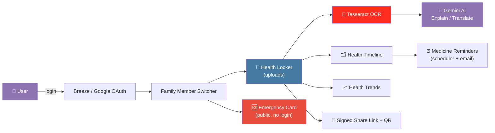

<div align="center">

# 🩺 Novix

### Your family's health records, organized, secure, and explained in plain language.

[](https://laravel.com)
[](https://www.php.net)
[](https://www.mysql.com)
[](https://tailwindcss.com)
[](https://ai.google.dev)
[](LICENSE)

[](#-roadmap)
[](#-going-live-for-free)
[](#-contributing)

</div>

---

## 📖 About

**Novix** is a secure, family-oriented health record manager. It gives a household a single place to store, understand, and act on every family member's medical history — reports, prescriptions, medications, and emergency information — with AI doing the heavy lifting of turning dense medical documents into language anyone can understand.

This repository is the **Phase 1 free-tier MVP**: a full-featured Laravel/PHP application that can be built and run entirely on free tools, with a clear upgrade path to paid infrastructure once it outgrows the free tier.

> ⚠️ **Not a medical device.** Novix organizes and explains records for convenience. It does not diagnose, prescribe, or replace a qualified doctor.

---

## ✨ Features

| | Feature | Description |
|---|---|---|
| 👨‍👩‍👧‍👦 | **Family Health Account** | Add, edit, and switch between profiles for every family member — parents, spouse, children, grandparents — from one navigation-wide switcher. |
| 🔐 | **Secure Health Locker** | Upload reports (blood tests, prescriptions, X-rays, insurance, bills, ECGs) with automatic rule-based categorization and image compression. |
| 🗂️ | **Personal Health Timeline** | A reverse-chronological, month-grouped view of every report and medication per family member, with distinct icons per category. |
| 🔎 | **OCR Extraction** | Tesseract OCR pulls readable text out of uploaded scans and photos for review and manual correction. |
| 🤖 | **AI Report Explanations** | Google Gemini turns dense OCR'd report text into a plain-language summary and flags abnormal values — always with a "not medical advice" disclaimer. |
| 🔗 | **Secure Report Sharing** | Generate signed, time-limited links (48h expiry) with QR codes to share a single report with anyone, no login required. |
| 🆘 | **Emergency Medical Card** | A public, no-login page per family member showing blood group, allergies, medications, and emergency contact — built for the moment it matters most. |
| ⏰ | **Medicine Reminders** | Scheduled reminder emails, checked every 15 minutes, for upcoming doses. |
| 🌐 | **Multilingual Support** | Hindi and Gujarati translations of AI summaries, cached so nothing is translated twice. |
| 📈 | **Health Trends** | Numeric values (blood pressure, blood sugar, weight, HbA1c, cholesterol) extracted from reports and charted over time with Chart.js. |
| 🛡️ | **Security & Privacy** | Per-user ownership checks on every record, validated uploads, non-browsable storage, full audit logging, and one-click account deletion. |

---

## 🧱 Tech Stack

<div align="center">

| Layer | Technology |
|---|---|
| **Backend** | Laravel 11 (PHP 8.2+) |
| **Database** | MySQL 8 |
| **Frontend** | Blade + Tailwind CSS |
| **Auth** | Laravel Breeze — email/password & Google OAuth (Socialite) |
| **OCR** | Tesseract |
| **AI** | Google Gemini (`gemini-1.5-flash`) |
| **Charts** | Chart.js |
| **Local Dev** | Laravel Herd + DBngin |

</div>

---

## 🏗️ Architecture



---

## 🚀 Getting Started

### Prerequisites

- macOS with [Laravel Herd](https://herd.laravel.com) (PHP, nginx, Composer)
- [DBngin](https://dbngin.com) running a MySQL 8 instance
- Xcode Command Line Tools (`xcode-select --install`)
- [Homebrew](https://brew.sh) with Tesseract: `brew install tesseract`
- A free [Google Gemini API key](https://aistudio.google.com)

### Installation

```bash
# Clone into Herd's parked path so it's served at novix.test
git clone https://github.com/neevmodh/Novix.git ~/Sites/novix
cd ~/Sites/novix

# Install dependencies
composer install

# Configure environment
cp .env.example .env
php artisan key:generate

# Set up the database
php artisan migrate

# Compile front-end assets
npm install && npm run build
```

Add your keys to `.env`:

```dotenv
GEMINI_API_KEY=your-gemini-api-key
GOOGLE_CLIENT_ID=your-google-oauth-client-id
GOOGLE_CLIENT_SECRET=your-google-oauth-client-secret
MAIL_MAILER=smtp
MAIL_HOST=smtp.gmail.com
MAIL_USERNAME=your-email
MAIL_PASSWORD=your-app-password
```

Then visit **http://novix.test** 🎉

---

## 🗺️ Roadmap

- [x] Family Health Account & profile switching
- [x] Secure Health Locker with OCR
- [x] AI report explanations (Gemini)
- [x] Secure sharing & Emergency Medical Card
- [x] Medicine reminders & multilingual support
- [x] Health Trends dashboard
- [ ] Security hardening & audit logging pass
- [ ] Free-tier production deployment
- [ ] **Phase 2:** custom domain, VPS hosting, paid AI headroom

---

## 🔒 Security

- Every uploaded file is validated by type and size before storage.
- Every route touching family data verifies record ownership against the logged-in user.
- The reports storage folder is never publicly browsable.
- Every view, share, and AI-explain action is written to an `audit_log`.
- Users can permanently delete their account and all associated data at any time.

Found a vulnerability? Please open a private security advisory rather than a public issue.

---

## 🤝 Contributing

Contributions, issues, and feature requests are welcome!

1. Fork the repo
2. Create your feature branch (`git checkout -b feature/amazing-feature`)
3. Commit your changes (`git commit -m 'Add some amazing feature'`)
4. Push to the branch (`git push origin feature/amazing-feature`)
5. Open a Pull Request

---

## 📄 License

Distributed under the **Apache License 2.0**. See [`LICENSE`](LICENSE) for details.

---

<div align="center">

Made with ❤️ for families everywhere.

</div>
