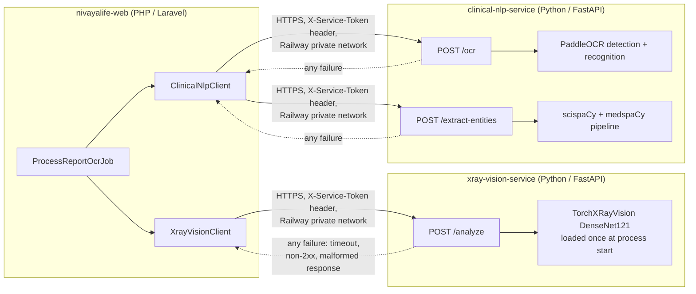
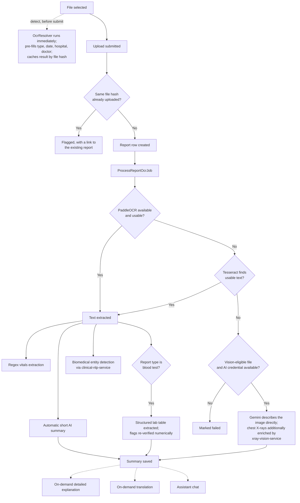

# NivayaLife

[](https://www.php.net)
[](https://laravel.com)
[](https://www.python.org)
[](https://fastapi.tiangolo.com)
[](https://www.mysql.com)
[](https://pytorch.org)
[](https://tailwindcss.com)
[](https://alpinejs.dev)
[](https://vitejs.dev)
[](Dockerfile)
[](https://railway.com)
[](LICENSE)

NivayaLife is a family health record manager. It gives a household a single place to store, understand, and act on every family member's medical history — lab reports, prescriptions, medications, vitals, allergies, and emergency information — instead of scattered paper files and phone photos.

Every family member is represented as their own record with two possible modes: a linked member who has their own login (the account owner, or anyone they've invited who accepted), or a dependent member with no login of their own (a child, an elderly parent) whose records the primary account manages directly. Two independent adult accounts can also link to each other and share access on their own terms.

NivayaLife is not a medical device. It organizes, extracts, and explains records for convenience. Every AI-generated summary carries a disclaimer and is never presented as a diagnosis. It does not replace a qualified doctor.

## Contents

- [System overview](#system-overview)
- [Features](#features)
- [Tech stack](#tech-stack)
- [Microservices architecture](#microservices-architecture)
- [Python models and libraries](#python-models-and-libraries)
- [Report processing pipeline](#report-processing-pipeline)
- [Other pipelines](#other-pipelines)
- [Database schema](#database-schema)
- [Project structure](#project-structure)
- [Application routes](#application-routes)
- [Getting started](#getting-started)
- [Deployment](#deployment)
- [Testing](#testing)
- [Security and privacy](#security-and-privacy)
- [Roadmap](#roadmap)
- [License](#license)

## System overview

NivayaLife runs as three deployed services, one PHP and two Python, connected over a private network:

| Service | Language | Framework | Role |
|---|---|---|---|
| `nivayalife-web` | PHP 8.4 | Laravel 11 | The main application — every user-facing page, all data storage, authentication, and orchestration |
| `xray-vision-service` | Python 3.11 | FastAPI | A pretrained chest X-ray classifier, called only for `xray`-type reports |
| `clinical-nlp-service` | Python 3.11 | FastAPI | PaddleOCR (primary text extraction) plus biomedical entity recognition |

Both Python services are optional from the main application's point of view. Every call to either one is wrapped in a try/catch on the Laravel side; if a service is unreachable, misconfigured, slow, or returns an error, NivayaLife falls back to its next-best option automatically rather than failing the request. Nothing in the report pipeline hard-depends on either service being available — see [Microservices architecture](#microservices-architecture) for exactly how that fallback works.

## Features

### Identity and family structure

Registration asks only for full name, email, password, phone number, and gender. Everything else — date of birth, blood group, photo, address, height and weight, emergency contact — is optional and can be filled in later from the profile pages. Sign-in supports Google OAuth or email and password; a new Google identity is only written to the database once registration completes, so an abandoned sign-up never leaves a half-created account.

A primary account can add dependents (no login of their own) or invite an independent adult by email. If the person being invited already has their own NivayaLife account, acceptance creates a reciprocal sharing grant instead of colliding with their existing profile — both sides see the connection and can revoke it independently. Every invited person chooses their own sharing scope: full access, reports only, or summary only.

The dashboard shows a family-member switcher, a BMI trend, recent reports with AI summaries, today's medications, and quick-action tiles. A first-run checklist walks a new account through its first real actions, computed from actual data rather than a fixed flag. Dark mode is persisted server-side per user, so it follows the account across devices.

### Reports, OCR, and AI

Reports can be uploaded as PDF, Word, or image files (JPG, PNG, WEBP, TIFF, BMP, GIF), individually or in batches, via drag-and-drop, file picker, or camera capture. The moment a file is selected — before the form is even filled in — it is read in the background and used to pre-fill the report type, date, hospital, and doctor fields; a manually edited field is never overwritten. Re-uploading the exact same file (matched by content hash, not filename) is caught and flagged rather than silently duplicated.

Text extraction tries PaddleOCR first (via `clinical-nlp-service`), since it is generally more accurate than Tesseract on real-world uploads — phone photos, skewed scans, mixed layouts. If PaddleOCR is unavailable or finds nothing usable, Tesseract runs as a fallback (pages of a multi-page PDF processed concurrently, images preprocessed for grayscale/contrast/deskew/despeckle, garbled reads retried at 90/180/270 degree rotation). If neither engine finds any usable text at all — the common case for a raw scan image with no embedded text, such as an X-ray, sonography, or MRI film — the file is instead described directly by a vision-capable AI model. For chest X-rays specifically, that description is additionally grounded with real classifier output from `xray-vision-service`.

Once text is available, an automatic two-to-three sentence AI summary is generated. For blood test reports specifically, the full lab table (test name, result, unit, reference range, and a normal/low/high/borderline flag) is parsed into a structured table rather than lost inside a paragraph; the flag on each row is independently re-derived from a direct numeric comparison against the reference range whenever possible, rather than trusting the model's own arithmetic. Where a family member has two or more historical values for the same metric, a trend chart is shown on the report page. Extracted lab values also feed a lightweight regex-based extractor that populates structured vitals (blood pressure, blood sugar, HbA1c, cholesterol, hemoglobin) with no AI cost. Biomedical entities — drug names and diagnoses mentioned in the report text, with negation detection so "no history of hypertension" is never surfaced as a positive finding — are pulled out separately by `clinical-nlp-service` and shown alongside the summary.

Everything beyond the automatic summary is on demand: a fuller, plain-language detailed explanation with doctor-discussion questions; translation of the summary between English, Hindi, and Gujarati (each language translated once and cached); and a per-family-member AI assistant chat that answers questions from that person's actual records. Every AI call routes through a single client that tries up to three Gemini API keys and then Groq as a last resort, so one key hitting its usage limit does not take AI features down.

### Medications and vaccinations

Medications support dosage, frequency, multiple reminder times per day, a start and end date range, and a per-medication reminder toggle. A daily job generates each day's pending dose slots; a recurring sweep sends a reminder email around each scheduled time and marks a dose missed after a grace period if nobody acted on it. Vaccinations track dose number, date administered, and next-due date, with a daily reminder email for anything due within a week or already overdue.

### Sharing and emergency access

A public emergency card page — reachable by scanning a real QR code, no login required — shows photo, computed age, blood group, allergies, active conditions and medications, and a tap-to-call emergency contact. Deactivating it hides everything immediately. Wallet-sized and full-page PDF versions are available, with the same QR code embedded, meant to be printed and carried.

Individual reports or a family member's full history can be shared via a link that always expires (24 hours, 48 hours, 7 days, or a custom date — there is no "never expires" option), with an optional four-digit PIN and an optional one-time-view mode that revokes itself immediately after the first open. Every share ever created is listed with its live status, view count, and a one-click revoke.

### Timeline and administration

The health timeline merges reports, medications, vaccinations, and vitals into one chronological feed with filtering, full-text search, and a compare-over-time view. A date range can be exported as a PDF summary suitable for a first consultation with a new doctor.

An administrative dashboard, gated behind an `is_admin` flag on a single account, provides read-only charts and metrics plus a generic table browser (create, edit, delete, CSV export) across the schema, for operational use rather than end-user access.

Sensitive actions — account creation, invitations, sharing grants and revokes, card reissues, share views, and every sign-in attempt — are written to an append-only audit log.

### Installability

NivayaLife ships a web app manifest, a service worker, and a custom install-prompt banner, so it can be added to a phone's home screen and launched full-screen, without going through an app store. The service worker deliberately caches nothing except the versioned build output — no page, API response, or report data is ever served from cache — so the app fails safely offline rather than risking stale medical information.

## Tech stack

### Application (nivayalife-web)

| Layer | Technology |
|---|---|
| Language | PHP 8.4 |
| Framework | Laravel 11 |
| Database | MySQL |
| Queue | Laravel queues, database driver |
| Scheduler | Laravel's own cron-driven scheduler |
| Auth scaffolding | Laravel Breeze (Blade stack) |
| OAuth | Laravel Socialite (Google) |
| Fallback OCR | Tesseract 5, run as concurrent OS processes per page |
| PDF rasterization | Imagick + Ghostscript |
| AI providers | Google Gemini REST API (up to three keys) with Groq (OpenAI-compatible) as a fallback |
| Outbound email | Resend |
| PDF generation | barryvdh/laravel-dompdf |
| QR codes | simplesoftwareio/simple-qrcode (SVG on screen, PNG in PDFs) |
| Charts | ApexCharts |
| Interactivity | Alpine.js 3 |
| CSS framework | Tailwind CSS 3 |
| Build tool | Vite 6 |
| Location data | country-state-city |
| Progressive Web App | Web app manifest, service worker, custom install prompt |

Model-level validation runs on every save via a shared trait, so invalid data cannot reach the database even if a caller bypasses form-request validation. Every PDF and QR code is produced by two shared services rather than each feature implementing its own. AI usage is cost-gated by design: only the short automatic summary runs without a user click; everything else is on demand and cached where re-viewing something already generated should not spend usage twice.

### Python services

Both services are built on FastAPI + Uvicorn, packaged in their own Docker image, and expose a small authenticated HTTP API — see [Python models and libraries](#python-models-and-libraries) for the full dependency list and what each one does.

## Microservices architecture



Every call from Laravel to either Python service follows the same shape:

1. **Configuration.** Each service's base URL and a shared-secret bearer token are read from environment variables (`XRAY_VISION_URL` / `XRAY_VISION_TOKEN`, `CLINICAL_NLP_URL` / `CLINICAL_NLP_TOKEN`). If a URL is not set, the corresponding client reports itself as unconfigured and the caller skips it entirely — no network call is attempted.
2. **Transport.** Laravel's HTTP client (Guzzle under the hood) sends a plain HTTPS `POST` request with the request body as multipart form data (image uploads) or JSON (text payloads), and the token attached as an `X-Service-Token` header. In production this traffic never leaves Railway's private network — the two Python services have no public domain.
3. **Authentication.** Each Python service checks the incoming `X-Service-Token` header against its own copy of the same secret (`XRAY_VISION_TOKEN` / `CLINICAL_NLP_TOKEN` in its own environment) and returns `401` on a mismatch, before doing any real work.
4. **Timeouts.** Requests are bounded (20–30 seconds depending on the call) so a stalled or overloaded Python service cannot hang the report pipeline indefinitely.
5. **Failure handling.** Every call site on the Laravel side is wrapped in its own try/catch. A timeout, a non-2xx response, a connection refusal, or an unexpected response shape is caught, logged, and treated as "this enrichment isn't available right now" — never as a reason to fail the report itself. The pipeline always has a next-best fallback: PaddleOCR unavailable falls back to Tesseract; Tesseract unusable falls back to a vision description; the X-ray classifier unavailable just means the vision description has no model-estimated findings to reference; entity detection unavailable just means no drug/diagnosis chips are shown.
6. **Response shape.** Both services return small, flat JSON objects — pathology/probability pairs from the classifier, extracted text plus a usability flag from OCR, entity/label/negation triples from entity recognition — designed to be dropped straight into a database column with minimal transformation on the PHP side.

Both Python services also load their models exactly once, at process startup, not per request — the classifier and NLP pipelines stay resident in memory for the life of the container, so a single request only pays for inference, not model loading.

## Python models and libraries

### xray-vision-service

| Package | Version | Purpose |
|---|---|---|
| `torch` | 2.5.1 (CPU build) | Tensor runtime the classifier executes on |
| `torchvision` | 0.20.1 (CPU build) | Image transforms used by the preprocessing pipeline |
| `torchxrayvision` | 1.3.4 | Provides the pretrained `densenet121-res224-all` chest X-ray classification model |
| `fastapi` | 0.115.6 | HTTP API framework |
| `uvicorn` | 0.34.0 | ASGI server running the FastAPI app |
| `python-multipart` | 0.0.20 | Multipart form parsing for image uploads |
| `pillow` | 11.1.0 | Image loading and format conversion before inference |
| `numpy` | 1.26.4 | Array operations feeding the model |

**Model:** `densenet121-res224-all`, a DenseNet-121 convolutional network pretrained across ChestX-ray14, CheXpert, MIMIC-CXR, and PadChest, released by the TorchXRayVision project. Given a chest X-ray image, it returns a probability estimate for roughly eighteen findings (effusion, cardiomegaly, atelectasis, and so on). The service runs the model CPU-only (no GPU dependency) and returns the top findings by probability as plain JSON. This is classifier output, not a diagnosis — the application prompt explicitly instructs the AI summary step to treat it only as supporting context, and to disregard it entirely if the image does not actually look like a chest X-ray.

### clinical-nlp-service

| Package | Version | Purpose |
|---|---|---|
| `paddlepaddle` | 2.6.2 | Deep learning framework PaddleOCR is built on |
| `paddleocr` | 2.9.1 | Text detection and recognition — the primary OCR engine |
| `pyclipper` | 1.3.0.post6 | Polygon operations used internally by PaddleOCR's text detector |
| `scipy` | 1.13.1 | Numerical routines used by the PaddleOCR/PaddlePaddle stack |
| `spacy` | 3.7.5 | Core NLP pipeline framework |
| `medspacy` | 1.3.1 | Clinical NLP components layered on spaCy — negation and context detection |
| `en_core_sci_sm` | 0.5.4 | scispaCy's small English biomedical model, providing the base named-entity recognition |
| `fastapi` | 0.115.6 | HTTP API framework |
| `uvicorn` | 0.34.0 | ASGI server running the FastAPI app |
| `python-multipart` | 0.0.20 | Multipart form parsing for image uploads |
| `pillow` | 11.1.0 | Image loading and format conversion |
| `numpy` | 1.26.4 | Array operations |

**OCR models:** PaddleOCR's PP-OCR pipeline — a lightweight text-detection network followed by a text-recognition network, run in sequence per page. Weights are downloaded and cached inside the container image at build time so a fresh deployment never stalls on a cold model download.

**NLP pipeline:** `en_core_sci_sm` provides the base biomedical entity recognizer; medspaCy is layered on top to add negation detection (the `is_negated` attribute on each matched entity), so a phrase like "no history of hypertension" is correctly excluded rather than surfaced as a positive finding. The `medspacy_pyrush` sentence-boundary component is deliberately excluded from the pipeline, since it conflicts with the sentence boundaries `en_core_sci_sm`'s own parser already sets.

Both services set their respective libraries to single-threaded execution (`torch.set_num_threads(1)`, PaddleOCR's `cpu_threads=1`) — on a CPU-quota-limited host, letting either library spawn a thread per visible core causes contention that slows inference down rather than speeding it up.

## Report processing pipeline



## Other pipelines

**AI provider fallback.** Every AI feature calls a single client that tries each configured Gemini key in order, then Groq, then retries the whole chain once more before giving up. A credential that just failed is skipped for a cooldown window rather than retried on every call.

**Medication and vaccination reminders.** A daily job creates each day's pending dose rows. A recurring job sends a reminder email for any dose due soon and marks overdue doses missed. A separate daily job emails vaccination reminders for anything due within a week or already overdue. All scheduling runs on the application's configured timezone (Asia/Kolkata by default), not UTC.

**Emergency card and report sharing.** Both features are built on the same two shared services — a QR code service and a PDF export service — so a QR code and a PDF are never implemented twice. A share or card view checks active status, expiry, and revocation before rendering; a one-time-view share revokes itself immediately after its first successful view.

## Database schema

The domain schema is organized into five areas: identity and family structure (users, family members, invitations); health profile (allergies, chronic conditions, vaccinations, doctors); reports, vitals, and AI processing (reports, BMI logs, health metrics, AI job and response history, chat messages); medications (medications, medication logs); and sharing, identity cards, and compliance (shares, ID cards, consents, audit log, login log, sharing permissions, insurance policies). Foreign keys use deliberate cascade rules — tables holding real medical history restrict deletion of their parent family member row, so a routine edit can never silently destroy medical history; a full account deletion explicitly cascades through every dependent table in the correct order instead.

## Project structure

```
nivayalife/
├── app/
│   ├── Console/Commands/          Scheduled jobs: medication logs, reminders,
│   │                               vaccination reminders, invitation expiry
│   ├── Http/Controllers/
│   │   ├── Auth/                  Login, Google OAuth, registration
│   │   ├── Admin/                 Admin dashboard and table browser
│   │   ├── Concerns/               Shared traits (active family member resolution)
│   │   ├── DashboardController.php
│   │   ├── EmergencyCardController.php
│   │   ├── FamilyController.php, FamilyAddController.php,
│   │   │   FamilyInviteController.php, FamilyDependentController.php
│   │   ├── InvitationController.php
│   │   ├── IdCardController.php
│   │   ├── ReportUploadController.php, ReportController.php, ReportAiController.php
│   │   ├── MedicationController.php, VaccinationController.php
│   │   ├── AiChatController.php
│   │   ├── ShareController.php, PublicShareController.php
│   │   ├── TimelineController.php
│   │   └── ProfileController.php
│   ├── Jobs/                      ProcessReportOcrJob, ExtractHealthMetricsJob,
│   │                               GenerateShortSummaryJob, ExtractLabResultsJob
│   ├── Mail/
│   ├── Rules/                     NoHeaderInjection (CRLF-injection hardening)
│   ├── Services/
│   │   ├── Ai/                    AiClient — multi-credential fallback router
│   │   ├── Assistant/             Assistant prompt context builder
│   │   ├── Gemini/, Groq/         Provider clients
│   │   ├── Ocr/                   OcrExtractor (Tesseract), OcrResolver (engine selection)
│   │   ├── ClinicalNlp/           Client for clinical-nlp-service
│   │   ├── XrayVision/            Client for xray-vision-service
│   │   ├── Pdf/, Qr/              Shared PDF and QR services
│   │   └── Reports/               Regex vitals extractor, upload field detector
│   └── Models/
├── xray-vision-service/
│   ├── main.py                    FastAPI app, model load, /health, /analyze
│   ├── requirements.txt
│   └── Dockerfile
├── clinical-nlp-service/
│   ├── main.py                    FastAPI app, model load, /health, /ocr, /extract-entities
│   ├── requirements.txt
│   └── Dockerfile
├── database/migrations/
├── resources/
│   ├── js/alpine/                 Alpine.js components
│   └── views/
│       ├── admin/, auth/, components/, emergency/, emails/, family/,
│       │   invite/, medications/, vaccinations/, assistant/, profile/tabs/,
│       │   reports/, shares/, timeline/
│       └── dashboard.blade.php
└── routes/
    ├── web.php
    ├── console.php
    └── auth.php
```

## Application routes

Authentication and registration; dashboard and profile; family management and invitations; report upload, OCR, and AI; medications and vaccinations; the AI assistant; the emergency card; report sharing; the health timeline; and the admin dashboard. See `routes/web.php` and `routes/auth.php` for the full route list.

## Getting started

### Prerequisites

- PHP 8.4 with Composer
- MySQL
- Node.js and npm
- Tesseract OCR and Ghostscript (`brew install tesseract ghostscript` on macOS)
- The PHP Imagick extension
- A Google Gemini API key (required for AI summaries, explanations, translations, and the assistant). Up to two backup Gemini keys and a Groq API key are optional fallbacks.
- A Google OAuth client ID and secret, optional, for Google sign-in
- Python 3.11 with the dependencies in `xray-vision-service/requirements.txt` and `clinical-nlp-service/requirements.txt`, if running those services locally — both are optional; the application works without them, using its built-in fallbacks

### Installation

```bash
git clone https://github.com/NovixHealth/Novix.git
cd Novix

composer install
npm install

cp .env.example .env
php artisan key:generate

php artisan migrate
php artisan storage:link

npm run build
```

Configure `.env`:

```dotenv
APP_TIMEZONE=Asia/Kolkata

GOOGLE_CLIENT_ID=
GOOGLE_CLIENT_SECRET=
GOOGLE_REDIRECT_URI=http://localhost:8000/auth/google/callback

GEMINI_API_KEY=
GEMINI_API_KEY_2=
GEMINI_API_KEY_3=
GEMINI_MODEL=gemini-flash-latest
GROQ_API_KEY=
GROQ_MODEL=llama-3.3-70b-versatile

# Optional — enrichment only, the app works without these configured
XRAY_VISION_URL=
XRAY_VISION_TOKEN=
CLINICAL_NLP_URL=
CLINICAL_NLP_TOKEN=

MAIL_MAILER=resend
MAIL_FROM_ADDRESS=
RESEND_KEY=

QUEUE_CONNECTION=database
```

`php artisan serve` and `queue:work` read `.env` only at startup — restart both after changing any credential.

Run the application and a queue worker together; OCR and AI calls run as background jobs and never block the upload response:

```bash
php artisan serve
php artisan queue:work
```

Then visit `http://localhost:8000`.

### Running the Python services locally (optional)

```bash
cd xray-vision-service
pip install -r requirements.txt
uvicorn main:app --port 8001

cd clinical-nlp-service
pip install -r requirements.txt
uvicorn main:app --port 8002
```

Set `XRAY_VISION_TOKEN` / `CLINICAL_NLP_TOKEN` identically in both the service's own environment and the main application's `.env`, and point `XRAY_VISION_URL` / `CLINICAL_NLP_URL` at the local ports above. Without them set, NivayaLife falls back to Tesseract for OCR and skips X-ray classifier enrichment and entity detection entirely — no other behavior changes.

## Deployment

The production deployment runs three services on Railway: the main Laravel application (Docker, PHP-FPM behind nginx, with a queue worker and scheduler running in the same container), and the two Python services each in their own container, each with its own `Dockerfile`. The two Python services communicate with the main application over Railway's private network and are not exposed publicly — they have no public domain, and every request to them requires the shared-secret token described in [Microservices architecture](#microservices-architecture). The main application container runs migrations automatically on boot.

## Testing

```bash
php artisan test
```

The suite covers authentication and registration, the report processing pipeline (OCR engine selection and fallback, vision description, X-ray classifier enrichment, lab result extraction and flag verification, biomedical entity detection), and report sharing. Every test that exercises the Python services fakes the HTTP calls rather than reaching a real service, and includes explicit cases for both services being unconfigured and returning an error, to guarantee the fallback behavior actually holds.

## Security and privacy

**Data access and authorization**

- Every route touching family data verifies record ownership or an active sharing grant against the logged-in user; edit-level actions require full-scope access, never a viewing grant alone.
- Report files and generated QR codes are stored on a private disk and served through authorization-checked routes — never a public or guessable URL.
- The admin dashboard is gated by a dedicated middleware checking an `is_admin` flag on the authenticated user; there is no separate admin credential.

**Data integrity**

- Model-level validation (a shared trait hooked into Eloquent's `saving` event) runs on every save, independent of and in addition to form-request validation — invalid data cannot reach the database even if a caller bypasses the controller's own validation.
- Foreign keys use deliberate, medically-safe cascade rules: tables holding real medical history (BMI logs, allergies, medications, reports, and others) restrict deletion of their parent family member row, so a routine edit can never silently destroy medical history. Full account deletion requires a typed confirmation plus password re-entry, and explicitly cascades through every dependent table in the correct order instead.

**Authentication**

- Passwords are hashed with Laravel's default hasher (bcrypt).
- A new Google identity is never written to the `users` table until registration fully completes — an abandoned sign-up leaves no account behind, via either auth path.
- Two-factor authentication columns (`two_factor_secret`, `two_factor_recovery_codes`) are stored with Eloquent's `encrypted` / `encrypted:array` casts, so they are never persisted in plain text.
- Every authentication attempt — successful or failed, across the password form, Google OAuth, and invitation acceptance — is written to a login log with IP address and user agent, via a single listener on Laravel's own authentication events.

**Sharing and public pages**

- Share links always expire; there is no "never expires" option. A share PIN is stored as a bcrypt hash and checked with a constant-time comparison, never stored or compared in plain text. A one-time-view link revokes itself immediately after its first successful view; an owner's manual revoke is an immediate, absolute stop for everyone, including anyone mid-view.
- Public pages expose only what is necessary — the emergency card never shows a home address; a shared report's PDF export includes only name, age, and blood group alongside the report content, never address or emergency contact.

**Email**

- A custom `NoHeaderInjection` validation rule rejects embedded carriage-return/line-feed characters in every user-supplied email field that reaches outbound mail (invitations, password reset, registration) — closing a CRLF header-injection gap independent of Laravel's own built-in email validation rule.

**Service-to-service communication**

- Both Python microservices sit entirely on the private network with no public domain, and every request to either one must carry a shared-secret bearer token that the service checks before doing any work — see [Microservices architecture](#microservices-architecture).
- A failure, timeout, or misconfiguration in either Python service degrades functionality gracefully (a fallback engine, or enrichment simply being skipped) and never surfaces as a failed request to the user.

**Auditing**

- Sensitive actions — account creation, invitations, sharing grants and revokes, card reissues, share views, and every sign-in attempt — are written to an append-only audit log with IP address and user agent, distinct from ordinary application logging.

**AI usage**

- AI usage is bounded by design: only the automatic short summary runs without a user click, and every other AI feature (detailed explanations, translation, the assistant chat) is on demand and cached where re-viewing something already generated should not spend usage twice.
- The lab-result extraction step never trusts a model's own arithmetic where it doesn't have to — every flag on a numeric reference range is independently recomputed from the actual numbers before being stored.

Found a vulnerability? Please open a private security advisory rather than a public issue.

## Roadmap

- [x] Single-step registration, with everything else optional and fillable later
- [x] Family dashboard, invitations, and reciprocal sharing
- [x] Emergency ID card with QR generation, reissue, and deactivation
- [x] Report upload with duplicate detection and upload-time auto-detect
- [x] PaddleOCR-first OCR pipeline with Tesseract and vision fallbacks
- [x] AI report summarization, structured lab result extraction, trend charts, on-demand detailed explanations, cached translation, and an assistant chat
- [x] Multi-credential AI fallback chain
- [x] Chest X-ray classifier and biomedical entity recognition, as optional enrichment services
- [x] Medication and vaccination reminders with real email delivery
- [x] Health timeline with filters, search, and compare-over-time
- [x] Time-boxed, PIN-protectable report sharing with QR and PDF export
- [x] Admin dashboard and table browser
- [x] Progressive Web App support (installable, offline-safe by design)
- [ ] Rate limiting on the share PIN entry endpoint
- [ ] Insurance policy management UI (`insurance_policies` table exists — no controller or views yet)
- [ ] Domain-verified outbound email
- [ ] Native Android application

## License

Distributed under the Apache License 2.0. See [LICENSE](LICENSE) for details.

<!-- test push: verifying the deploy-approval webhook, 2026-08-04 -->
