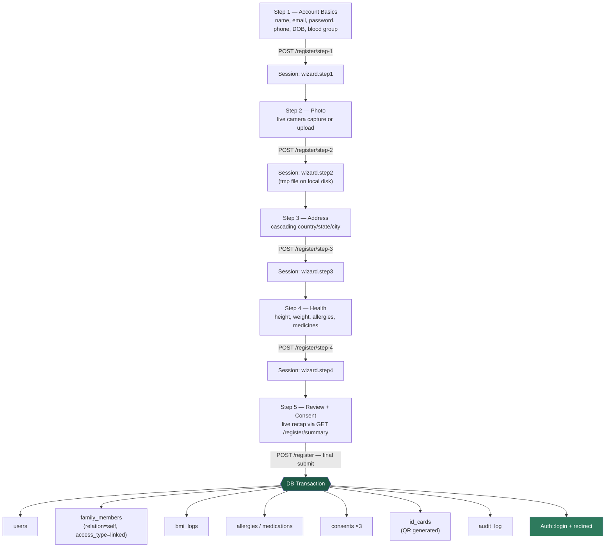
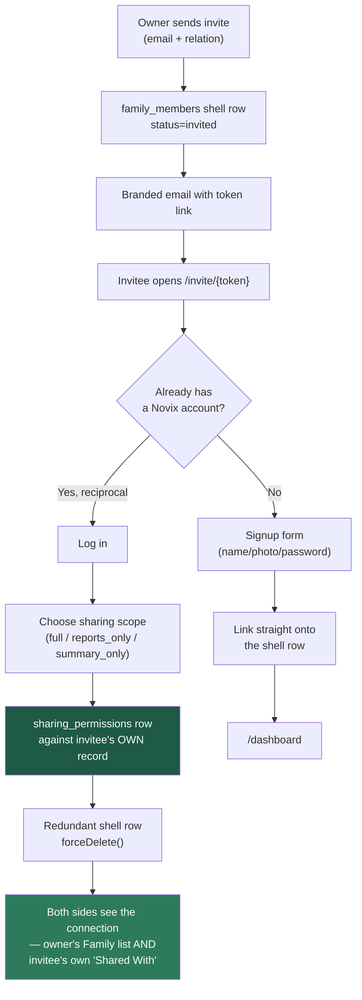
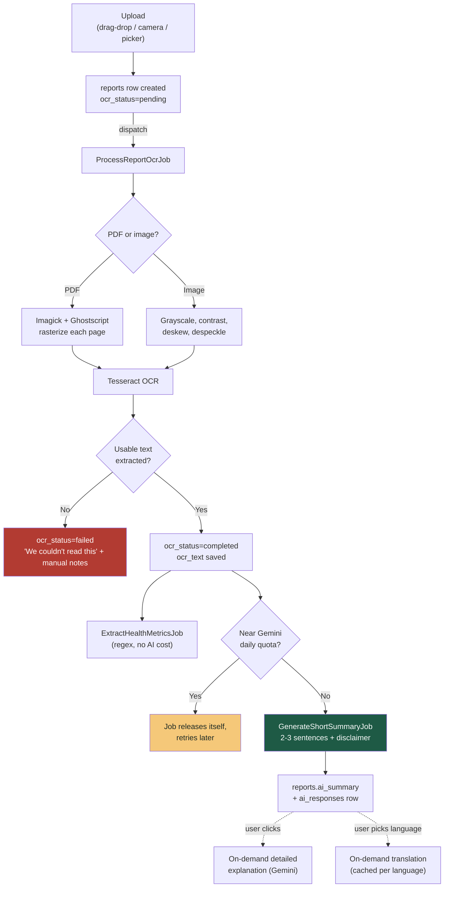
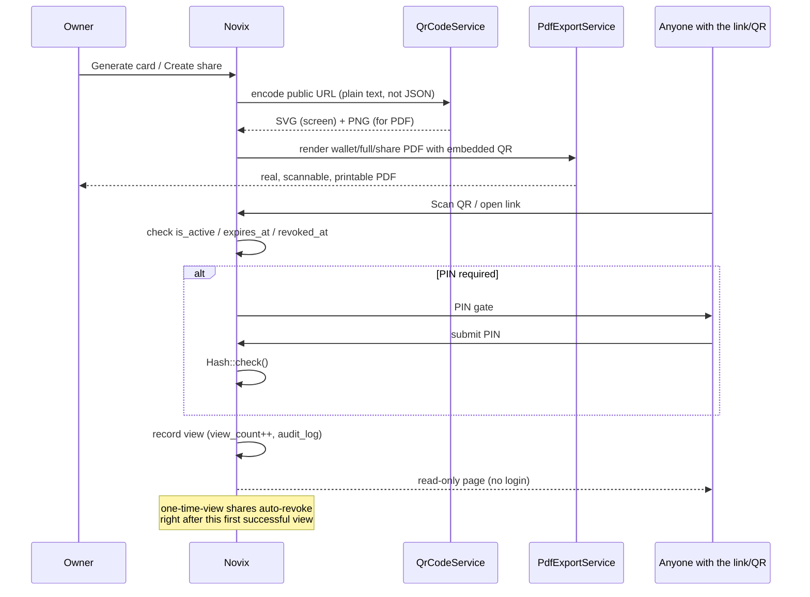
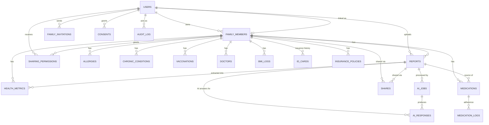

<div align="center">

# 🩺 Novix

### Your family's health records — organized, explained, and reachable in an emergency.

[](https://laravel.com)
[](https://www.php.net)
[](https://www.mysql.com)
[](https://tailwindcss.com)
[](https://alpinejs.dev)
[](https://vitejs.dev)
[](LICENSE)

[](#reports-ocr--ai-pipeline)
[](#reports-ocr--ai-pipeline)
[](#emergency-card--report-sharing-pipeline)
[](#-database-schema)
[](#-application-routes)
[](#-roadmap)

</div>

---

## 📑 Table of Contents

- [About](#-about)
- [Features](#-features)
- [Tech Stack](#-tech-stack)
- [Architecture & Pipelines](#-architecture--pipelines)
- [Database Schema](#-database-schema)
- [Project Structure](#-project-structure)
- [Application Routes](#-application-routes)
- [Getting Started](#-getting-started)
- [Security & Privacy](#-security--privacy)
- [Roadmap](#-roadmap)
- [Contributing](#-contributing)
- [License](#-license)

---

## 📖 About

**Novix** is a secure, family-oriented health record manager. It gives a household a single place to store, understand, and act on every family member's medical history — lab reports, prescriptions, medications, vitals, allergies, and emergency information — instead of scattered paper files and phone photos.

Every family member is represented as their own record with two possible modes: a **linked** member who has their own login (the account owner, or anyone they've invited who accepted), or a **dependent** member with no login of their own (a child, an elderly parent) whose records the primary account manages directly. Two independent adult accounts can also link to each other and share access on their own terms — never a one-way street.

> ⚠️ **Not a medical device.** Novix organizes, extracts, and explains records for convenience. Every AI-generated summary carries a disclaimer and is never presented as a diagnosis. It does not replace a qualified doctor.

---

## ✨ Features

### Onboarding & Identity

| | Feature | Description |
|---|---|---|
| 🧙 | **5-Step Animated Registration Wizard** | Session-backed multi-step signup (survives a page refresh) — account basics with live email availability + password strength, live selfie capture via the browser camera, cascading country/state/city address, an animated semi-circular BMI gauge with allergy/medicine tags, and a final review-and-confirm step with required consent capture. Nothing touches the database until the final step. |
| 🔐 | **Google OAuth + Password Auth** | Sign in with Google or email/password. A brand-new Google identity is never turned into a database row until the wizard's final step completes — an abandoned signup leaves no account behind either way. |
| 📸 | **Live Camera Capture** | `getUserMedia`-based capture with a face-guide overlay, square crop, client-side JPEG compression, and a file-upload fallback for devices without a camera. |
| 🌍 | **Cascading Location Picker** | Real country → state → city data (India defaulted, full global dataset), lazy-loaded on demand so it never bloats other pages. |

### Family & Dashboard

| | Feature | Description |
|---|---|---|
| 🏠 | **Family Dashboard** | Hero card with photo/blood group/health ID, live BMI trend, recent reports with AI summaries, today's medications, quick-action tiles, and a family-member switcher. |
| 👨‍👩‍👧 | **Family Management** | Invite an independent adult by email (they keep their own login and choose exactly what to share back — full, reports-only, or summary-only) or add a dependent with no login of their own. Archive/restore respects every `RESTRICT`-guarded medical table. An in-app popup surfaces pending invitations the moment you log in. |
| 🔁 | **Reciprocal Sharing** | If someone you invite already has their own Novix account, inviting them creates a two-way grant instead of colliding with their existing profile — both sides see the connection and can revoke it independently from their own "Shared With" list. |
| 👤 | **Tabbed Profile Editor** | Independently-saving tabs — Basic Info, Photo, Address, Health, Emergency Contact, Account Security — each with inline AJAX feedback, no full-page reloads. Reused for editing dependents and for full-access linked members. |
| 📈 | **BMI History, Not Overwrites** | Editing height/weight always inserts a new `bmi_logs` row, preserving trend history instead of destroying it. |
| 🌗 | **Dark Mode** | Toggle persisted server-side per user, not just in browser storage — follows you across devices. |

### Reports, OCR & AI

| | Feature | Description |
|---|---|---|
| 📤 | **Batch Report Upload** | Drag-and-drop, camera capture, or file picker for PDF/JPG/PNG — multiple files at once, each with its own thumbnail, upload-progress bar, and metadata form (type auto-suggested from the filename, editable before submit). |
| 🔍 | **Real OCR Pipeline** | A queued job runs every upload through **Tesseract** — PDFs are rasterized page-by-page via Imagick/Ghostscript first, photos get grayscale/contrast/deskew/despeckle preprocessing, since a real phone photo of a prescription is rarely flat and well-lit. |
| ✍️ | **Editable Extracted Text** | The OCR result is shown in a collapsible panel the user can correct by hand — a human correction always overwrites the machine's guess. |
| 🤖 | **Automatic Short AI Summary** | The moment OCR succeeds, a 2–3 sentence Gemini summary is generated automatically — deliberately brief, always disclaimer-stamped, and quota-aware (defers itself rather than failing if the free-tier daily cap is close). |
| 📚 | **On-Demand Detailed Explanation** | A "Get detailed explanation" button calls Gemini again for a fuller, plain-language breakdown with doctor-discussion questions — never auto-run, so it never burns quota without the user asking. Every explanation is kept in a permanent history, not just the latest. |
| 🌐 | **Cached Translation** | Switch the summary between English/Hindi/Gujarati — each language is translated once and cached in `ai_responses`; flipping back and forth never re-calls the API. |
| 📐 | **Pattern-Matched Vitals** | Blood pressure, blood sugar, HbA1c, cholesterol, and hemoglobin are parsed straight out of the OCR text into `health_metrics` — no AI call needed, feeds the timeline's trend view for free. |

### Emergency Access & Sharing

| | Feature | Description |
|---|---|---|
| 🪪 | **Public Emergency Card** | A no-login page any first responder can open by scanning a real QR code — photo, age (computed from DOB), blood group front-and-center, allergies flagged red-first by severity, active conditions/medications, tap-to-call emergency contact, family doctor. Deactivating it hides everything within seconds. |
| 🖨️ | **Print-Ready Card PDFs** | A wallet/ID-card-sized PDF and a full-page PDF, both with the same real, scannable QR code embedded — genuinely meant to be printed and carried, not a mockup. |
| 🌐 | **Multi-Language Card** | English/Hindi/Gujarati toggle on the public card — reads from a static label dictionary, never calls the AI API live. |
| ♻️ | **Reissue & Instant Deactivate** | Lost the card? Reissue generates a fresh card number and QR while keeping the old one on record as issuance history; deactivate flips it off instantly without needing a reissue. |
| 🔗 | **Time-Boxed Report Sharing** | Share one report or a family member's full history via a link that **always** expires (24h/48h/7 days/custom — never "forever"), optional 4-digit PIN (hash stored, never the plain code), and optional one-time-view that auto-revokes itself right after the first open. |
| 📱 | **Real Share QR + Native Share** | A scannable QR for the share link, one-tap copy, and the Web Share API for WhatsApp/Email where the browser supports it. |
| 📄 | **Doctor-Ready Share PDF** | The public share page's PDF export includes only minimal identity (name/age/blood group — never address or emergency contact), the original report image, OCR text, and the AI summary/explanation — laid out to actually hand to a doctor. |
| 📊 | **Share History, Never a Black Box** | Every link ever created for a family member, with live status (active/expired/revoked/viewed), view count, last-viewed time, and one-click revoke. |

### Timeline & Compliance

| | Feature | Description |
|---|---|---|
| 🕰️ | **Health Timeline** | Reports, medications, vaccinations, and vitals merged into one chronological feed, grouped by year → month with older years collapsed by default. Filter by category or date range, full-text search across every report's OCR text and AI summary, and inline accordion previews. |
| 📊 | **Compare Over Time** | Select two or more vitals of the same type and see them compared with the percentage change spelled out in plain language ("down 6.7% since March 1"). |
| 📑 | **Doctor-Ready Timeline Export** | Pick a date range and export a clean PDF summary of every report and metric in that window — meant to be handed to a new doctor at a first consultation. |
| 🛡️ | **Audit Logging** | Sensitive actions — account creation, invitations, sharing grants/revokes, card reissues, share views — are written to an immutable, insert-only `audit_log` table with IP/user-agent capture. |
| 🗑️ | **Full Account Deletion** | Typed "DELETE" confirmation, then a properly ordered cascade through every dependent table (respecting the schema's deliberate `RESTRICT` constraints) — a genuine full erasure, not a soft gesture. |

---

## 🧱 Tech Stack

<div align="center">

| Layer | Technology | Version |
|---|---|---|
| **Language** | PHP | 8.2+ (running 8.4.23) |
| **Backend Framework** | Laravel | 11.54 |
| **Database** | MySQL | 8 / 9 |
| **Queue** | Laravel Queues, `database` driver | — |
| **Auth Scaffolding** | Laravel Breeze (Blade stack) | 2.4 |
| **OAuth** | Laravel Socialite (Google) | 5.28 |
| **OCR Engine** | Tesseract (via Homebrew, shelled out through `Illuminate\Support\Facades\Process`) | 5.5 |
| **PDF Rasterization** | Imagick (PHP ext) + Ghostscript | 10.07 |
| **AI Summarization** | Google Gemini REST API (`gemini-flash-latest`) via a thin `GeminiClient` — no heavyweight SDK | — |
| **PDF Generation** | barryvdh/laravel-dompdf | 3.1 |
| **QR Codes** | simplesoftwareio/simple-qrcode (SVG on-screen, PNG embedded in PDFs) | 4.2 |
| **Templating** | Blade components | — |
| **Interactivity** | Alpine.js | 3.15 |
| **CSS Framework** | Tailwind CSS + `@tailwindcss/forms` | 3.x |
| **Build Tool** | Vite + laravel-vite-plugin | 6.x |
| **Location Data** | `country-state-city` (lazy-loaded chunk) | 3.2 |
| **Fonts** | Figtree (via Bunny Fonts, GDPR-friendly) | — |
| **Local Dev** | Laravel Herd / `php artisan serve` + DBngin | — |

</div>

**Why this stack:** Laravel's model-level validation (a custom `HasValidation` trait run on every `saving` event) means invalid data can never reach the database even if a caller bypasses form-request validation. Every PDF and QR code in the app is produced by two shared, reusable services — `PdfExportService` and `QrCodeService` — rather than each feature rolling its own, so a wallet card, a full emergency PDF, and a shared-report PDF all go through the exact same, verified rendering path. AI calls are cost-gated by design: only a short, automatic summary is ever generated without the user asking, everything else (detailed explanations, translations) is on-demand and cached so re-viewing something already generated never spends quota twice.

---

## 🏗️ Architecture & Pipelines

### Registration wizard pipeline

The wizard is **session-backed, not client-state-only**: each step's data is validated and persisted to the server session the moment "Next" is clicked (via `fetch`, no page reload), so refreshing mid-signup resumes exactly where you left off. **Nothing touches the database until step 5 commits** — an abandoned signup never leaves a half-created account.



### Family invitation & reciprocal sharing pipeline

Inviting someone who **already has their own account** can't simply link them to a second `family_members` row (`linked_user_id` is unique) — so acceptance detects that case and grants a `sharing_permissions` row against their *real* profile instead, leaving both people's own records untouched.



### Reports, OCR & AI pipeline

Upload responds **immediately** — OCR and every AI call happen in queued background jobs, never blocking the request. Only the short summary runs automatically; the detailed explanation and translations are strictly user-initiated to protect the Gemini free-tier daily quota.



### Emergency Card & Report Sharing pipeline

Both features are built on the same two shared services — `QrCodeService` and `PdfExportService` — so a QR code and a PDF are never re-implemented per feature.



---

## 🗄️ Database Schema

**28 tables total** — 20 domain tables + 8 Laravel framework tables (`users` base columns, `cache`, `jobs`, `sessions`, `password_reset_tokens`, `failed_jobs`, `job_batches`, `migrations`). All domain tables use `utf8mb4_unicode_ci` + InnoDB, with foreign keys carrying deliberate, medically-safe `CASCADE` / `RESTRICT` / `SET NULL` rules — for example, `bmi_logs`, `allergies`, and `medications` all `RESTRICT` deletion of their `family_members` row, so routine record edits can never silently destroy medical history (a full account deletion explicitly cascades through these in the correct order instead).

<details>
<summary><b>📊 Entity-Relationship Diagram (click to expand)</b></summary>



</details>

### 1️⃣ Identity & Family Structure

The account graph — a Google/password user, the family members they manage, and the email-invitation flow that upgrades a dependent into an independently-logged-in linked member (or reciprocally links two existing accounts).

| Table | Purpose | Key columns |
|---|---|---|
| 🟢 `users` | Login accounts | `email` (unique), `google_id` (unique), `password`, `phone`, `avatar_path`, `theme_preference`, two-factor columns |
| 🟢 `family_members` | Every person tracked — self, spouse, kids, parents | `primary_account_id` → users, `linked_user_id` → users (nullable, unique), `unique_health_id` (unique, `NVX-XXXXXXXX`), `relation`, `access_type` (`linked`/`dependent`), `status`, DOB, blood group, height/weight, address, emergency contact — soft-deletes |
| 🟢 `family_invitations` | Email-based invite flow — upgrades a dependent to linked, or reciprocally connects two existing accounts | `token` (unique), `status` (`pending`/`accepted`/`expired`), `expires_at`, `invited_by` |

### 2️⃣ Health Profile

Longitudinal clinical facts not tied to a single report.

| Table | Purpose | Key columns |
|---|---|---|
| 🟡 `allergies` | Known allergies | `allergen_name`, `severity` (`mild`/`moderate`/`severe`), `reaction_description` |
| 🟡 `chronic_conditions` | Ongoing conditions | `condition_name`, `status` (`active`/`managed`/`resolved`) |
| 🟡 `vaccinations` | Immunization history | `vaccine_name`, `dose_number`, `date_administered`, `next_due_date` |
| 🟡 `doctors` | Known doctors | `name`, `specialization`, `hospital_or_clinic_name` |

### 3️⃣ Reports, Vitals & AI Processing

Uploaded documents (full-text searchable), structured vitals, and the async AI summarization pipeline with a full answer-history table — never just the latest response.

| Table | Purpose | Key columns |
|---|---|---|
| 🔵 `reports` | Uploaded documents | `type` (blood_test/prescription/xray/mri_ct/insurance/bill/ecg/other), `ocr_text` (FULLTEXT indexed with `ai_summary`), `ocr_status` (pending/processing/completed/failed), `ai_summary` (cache of the latest short summary), `is_archived` — soft-deletes |
| 🔵 `bmi_logs` | BMI history over time | `height_cm`, `weight_kg`, `bmi_value` (auto-computed), `bmi_category` (auto-computed), `recorded_date`, `source` (`manual`/`report_extracted`) |
| 🔵 `health_metrics` | Extracted vitals (BP, sugar, cholesterol, HbA1c, hemoglobin...) | `metric_type`, `value`, `unit`, `recorded_date`, `source` (`manual`/`ocr_extracted`/`ai_extracted`) |
| 🔵 `ai_jobs` | Async AI job queue/quota tracking | `job_type` (ocr/summary/translation/entity_extraction), `status`, `provider`, `input_tokens`, `output_tokens` |
| 🔵 `ai_responses` | **Permanent history** of every AI answer — every summary, every detailed explanation, every translation | `response_type`, `content`, `language`, `provider`, `generated_at` |

### 4️⃣ Medications

| Table | Purpose | Key columns |
|---|---|---|
| 🟣 `medications` | Active/past prescriptions | `medicine_name`, `dosage`, `frequency`, `schedule_times` (JSON array), `active` |
| 🟣 `medication_logs` | Per-dose adherence log | `scheduled_at`, `taken_at`, `status` (`taken`/`missed`/`skipped`) |

### 5️⃣ Sharing, Identity Cards & Compliance

| Table | Purpose | Key columns |
|---|---|---|
| 🔴 `shares` | Time-boxed external share links — **never issued without an expiry** | `token` (unique), `access_type` (single_report/full_summary/emergency_card), `shared_with_label`, `pin_hash` (nullable, never the plain PIN), `is_one_time`, `expires_at`, `revoked_at`, `first_viewed_at`, `view_count` |
| 🔴 `id_cards` | Emergency ID cards — **full issuance history preserved**, never overwritten | `card_number` (unique), `photo_path` (snapshot at issue time), `qr_code_path`, `is_active` |
| 🔴 `consents` | Legal/compliance consent capture | `consent_type` (upload/ai_processing/sharing/account_creation), `ip_address`, `user_agent` |
| 🔴 `audit_log` | **Immutable**, insert-only action trail | `action`, `target_type`, `target_id`, `ip_address` — no `updated_at` by design |
| 🔴 `sharing_permissions` | A linked member's explicit, revocable grant of view access | Composite unique (`family_member_id`, `granted_to_user_id`), `scope`, `revoked_at` |
| 🔴 `insurance_policies` | Insurance policy tracking | `provider_name`, `policy_number`, `coverage_amount`, `expiry_date` |

---

## 📁 Project Structure

```
novix/
├── app/
│   ├── Http/Controllers/
│   │   ├── Auth/                    # Login, Google OAuth, registration wizard
│   │   ├── Concerns/                #   ResolvesActiveFamilyMember (shared trait)
│   │   ├── DashboardController.php
│   │   ├── EmergencyCardController.php   # Public emergency card + PDFs
│   │   ├── FamilyController.php          # Family list, show, archive/restore
│   │   ├── FamilyAddController.php       # /family/add form
│   │   ├── FamilyInviteController.php    # Invite by email
│   │   ├── FamilyDependentController.php # Add a dependent
│   │   ├── InvitationController.php      # Accept/decline flow (public + reciprocal)
│   │   ├── IdCardController.php          # Owner-side card management
│   │   ├── ReportUploadController.php    # Batch upload
│   │   ├── ReportController.php          # Report detail, OCR text edit, status polling
│   │   ├── ReportAiController.php        # Detailed explanation + translation
│   │   ├── ShareController.php           # Owner-side share creation + history
│   │   ├── PublicShareController.php     # Public share view, PIN gate, PDF
│   │   ├── TimelineController.php        # Merged timeline + PDF export
│   │   └── ProfileController.php
│   ├── Http/Requests/Registration/  # Per-step wizard validation
│   ├── Jobs/                        # ProcessReportOcrJob, ExtractHealthMetricsJob,
│   │                                 #   GenerateShortSummaryJob
│   ├── Services/
│   │   ├── Gemini/                  # GeminiClient, GeminiQuota
│   │   ├── Ocr/                     # OcrExtractor (Tesseract + Imagick)
│   │   ├── Pdf/                     # PdfExportService (shared by every PDF)
│   │   ├── Qr/                      # QrCodeService (shared by every QR code)
│   │   └── Reports/                 # HealthMetricExtractor (regex vitals parsing)
│   ├── Models/
│   │   ├── Concerns/HasValidation.php   # Model-level validation trait
│   │   └── *.php                        # 20 domain models
│   └── Policies/
├── config/emergency_card.php        # Static EN/HI/GU label dictionary
├── database/migrations/             # 29 sequential migrations
├── resources/
│   ├── js/
│   │   ├── alpine/                  # registration-wizard, camera-capture, bmi-gauge,
│   │   │                            #   location-select, tag-input, report-upload,
│   │   │                            #   report-processing, metric-compare, share-actions...
│   │   └── app.js                   # Registers all Alpine.data components
│   └── views/
│       ├── auth/wizard/             # 5 step partials
│       ├── components/              # Reusable x-* Blade components
│       ├── emergency/               # Public card + PDF templates
│       ├── family/                  # Family list/show/add
│       ├── invite/                  # Public invitation accept flow
│       ├── profile/tabs/            # Profile tabs (reused for dependents & full-access)
│       ├── reports/                 # Upload, index, detail
│       ├── shares/                  # Owner create/history + public views
│       ├── timeline/                # Merged timeline + PDF export
│       └── dashboard.blade.php
└── routes/
    ├── web.php
    └── auth.php
```

---

## 🌐 Application Routes

<details>
<summary><b>70+ routes — click to expand full list, grouped by feature</b></summary>

**Auth & Registration**

| Method | URI | Name |
|---|---|---|
| GET/POST | `/register`, `/register/step-{1..4}` | `register.*` |
| GET | `/register/check-email`, `/register/photo-preview`, `/register/summary` | `register.*` |
| GET/POST | `/login`, `/logout` | `login`, `logout` |
| GET/POST | `/auth/google/redirect`, `/auth/google/callback` | `auth.google.*` |
| GET/POST | `/forgot-password`, `/reset-password` | `password.*` |

**Dashboard & Profile**

| Method | URI | Name |
|---|---|---|
| GET | `/dashboard` | `dashboard` |
| POST | `/dashboard/switch/{familyMember}` | `dashboard.switch` |
| GET | `/profile` | `profile.edit` |
| POST | `/profile/{familyMember?}/{basic-info,photo,address,health,emergency-contact}` | `profile.*` |
| PATCH | `/profile/theme` | `profile.theme` |
| DELETE | `/profile` | `profile.destroy` |

**Family Management**

| Method | URI | Name |
|---|---|---|
| GET | `/family`, `/family/add`, `/family/{familyMember}`, `/family/{familyMember}/edit` | `family.*` |
| POST | `/family/invite`, `/family/dependent` | `family.invite.store`, `family.dependent.store` |
| POST/DELETE | `/family/invite/{invitation}/{resend,cancel}` | `family.invite.*` |
| POST | `/family/{familyMember}/{archive,restore}` | `family.*` |
| POST | `/family/sharing/{sharingPermission}/revoke` | `family.sharing.revoke` |
| GET/POST | `/invite/{token}`, `/invite/{token}/{register,permission,dismiss}` | `invite.*` |

**Reports, OCR & AI**

| Method | URI | Name |
|---|---|---|
| GET/POST | `/reports/upload`, `/reports` | `reports.upload`, `reports.store`, `reports.index` |
| GET | `/reports/{report}`, `/reports/{report}/{status,file}` | `reports.show`, `reports.status`, `reports.file` |
| PATCH | `/reports/{report}/ocr-text` | `reports.ocr-text` |
| POST | `/reports/{report}/{detailed-explanation,translate}` | `reports.*` |

**Emergency Card**

| Method | URI | Name |
|---|---|---|
| GET | `/emergency/{cardNumber}`, `/emergency/{cardNumber}/pdf`, `/emergency/{cardNumber}/pdf/wallet` | `emergency.*` (public, no auth) |
| GET | `/id-card` | `id-card.show` |
| POST | `/id-card/reissue`, `/id-card/{idCard}/toggle-active` | `id-card.*` |

**Report Sharing**

| Method | URI | Name |
|---|---|---|
| GET/POST | `/shares/create`, `/shares`, `/shares/history` | `shares.*` |
| POST | `/shares/{share}/revoke` | `shares.revoke` |
| GET/POST | `/s/{token}`, `/s/{token}/pin`, `/s/{token}/pdf`, `/s/{token}/file/{report}` | `share.public.*` (public, no auth) |

**Health Timeline**

| Method | URI | Name |
|---|---|---|
| GET | `/timeline`, `/timeline/export` | `timeline`, `timeline.export` |

</details>

---

## 🚀 Getting Started

### Prerequisites

- PHP 8.2+ with Composer
- MySQL 8/9 (via [DBngin](https://dbngin.com), Laravel Herd, or any local install)
- Node.js + npm
- **Tesseract OCR** and **Ghostscript** (`brew install tesseract ghostscript` on macOS) — required for the report OCR pipeline
- The PHP **Imagick** extension — required for PDF rasterization and PNG QR generation
- A [Google Gemini API key](https://ai.google.dev) — required for AI summaries/explanations/translations/assistant chat. Up to 2 backup Gemini keys and a [Groq API key](https://console.groq.com) are optional — if set, AI features automatically fall back through them in order when one hits its free-tier limit or fails (see `App\Services\Ai\AiClient`)
- A [Google OAuth client ID/secret](https://console.cloud.google.com) (optional, for Google sign-in)

### Installation

```bash
git clone https://github.com/neevmodh/Novix.git
cd Novix

# Install dependencies
composer install
npm install

# Configure environment
cp .env.example .env
php artisan key:generate

# Point .env at your database, then:
php artisan migrate
php artisan storage:link

# Build front-end assets
npm run build
```

Add your credentials to `.env`:

```dotenv
GOOGLE_CLIENT_ID=your-google-oauth-client-id
GOOGLE_CLIENT_SECRET=your-google-oauth-client-secret
GOOGLE_REDIRECT_URI=http://localhost:8000/auth/google/callback

GEMINI_API_KEY=your-gemini-api-key
GEMINI_API_KEY_2=optional-backup-gemini-key
GEMINI_API_KEY_3=optional-backup-gemini-key
GEMINI_MODEL=gemini-flash-latest
GROQ_API_KEY=optional-groq-key-as-final-fallback
GROQ_MODEL=llama-3.3-70b-versatile

QUEUE_CONNECTION=database
```

Run the app **and** a queue worker — OCR and AI calls run as background jobs and never block the upload response:

```bash
php artisan serve
php artisan queue:work
```

Then visit **http://localhost:8000** 🎉

---

## 🔒 Security & Privacy

- Model-level validation (`HasValidation` trait) runs on every `saving` event — invalid data can never reach the database even if a caller bypasses form-request validation.
- Every route touching family data verifies record ownership or an active `sharing_permissions` grant against the logged-in user; edit-level actions require full-scope access, never just a viewing grant.
- Foreign keys use deliberate, medically-safe cascade rules — `RESTRICT` on tables that hold real medical history (`bmi_logs`, `allergies`, `medications`, `reports`...), so routine edits can never silently wipe it.
- A brand-new Google identity is never written to `users` until registration fully completes — no half-created accounts from an abandoned signup, via either auth path.
- **Share links always expire** — there is no "never expires" option, by design. A 4-digit PIN is stored as a hash, never in plain text. A one-time-view link auto-revokes itself immediately after its first successful view; an owner's manual revoke is always an absolute, immediate stop for everyone, including whoever was mid-view.
- **Public pages leak nothing extra.** The emergency card shows only what a responder needs (never the home address); a shared report's PDF shows only name/age/blood group (never address or emergency contact) alongside the actual report content.
- Report files and QR codes are stored on a private disk and served through authorization-checked routes — never a public, guessable URL.
- Sensitive actions — account creation, invitations, sharing grants/revokes, card reissues/deactivation, and every share view — are written to an append-only `audit_log` with IP/user-agent capture.
- AI cost is gated by design: only the automatic short summary ever runs without a user click; the daily Gemini quota is checked before every automatic call and the job defers itself rather than failing outright when the free tier is nearly exhausted.
- Full account deletion requires a typed "DELETE" confirmation plus current-password re-entry, and explicitly cascades through every dependent table in the correct order.
- 2FA columns (`two_factor_secret`, `two_factor_recovery_codes`) are stored `encrypted`/`encrypted:array` at the Eloquent cast level.

Found a vulnerability? Please open a private security advisory rather than a public issue.

---

## 🗺️ Roadmap

- [x] Full database schema (28 tables, normalized, FK-audited)
- [x] Session-backed multi-step registration wizard
- [x] Google OAuth + email/password auth
- [x] Family dashboard with live BMI gauge
- [x] Tabbed profile editor
- [x] Family invitations — dependents and reciprocal linked-account sharing
- [x] Emergency ID card with real QR generation, reissue, and instant deactivate
- [x] Dark mode (server-persisted)
- [x] Report upload + real OCR pipeline (Tesseract + Imagick/Ghostscript)
- [x] AI report summarization, on-demand detailed explanations, and cached translation (Gemini)
- [x] Health timeline with filters, full-text search, and compare-over-time
- [x] Secure, time-boxed, PIN-protectable report sharing links with real QR + PDF export
- [ ] Medicine reminder scheduling (the `reminder_enabled` column exists — no notification job yet)
- [ ] Insurance policy management UI (`insurance_policies` table exists — no controller/views yet)
- [ ] Native mobile app / PWA packaging

---

## 🤝 Contributing

Contributions, issues, and feature requests are welcome!

1. Fork the repo
2. Create your feature branch (`git checkout -b feature/amazing-feature`)
3. Commit your changes (`git commit -m 'Add some amazing feature'`)
4. Push to the branch (`git push origin feature/amazing-feature`)
5. Open a Pull Request

---

## 📄 License

Distributed under the **Apache License 2.0**. See [`LICENSE`](LICENSE) for details.

---

<div align="center">

Made with ❤️ for families everywhere.

</div>
