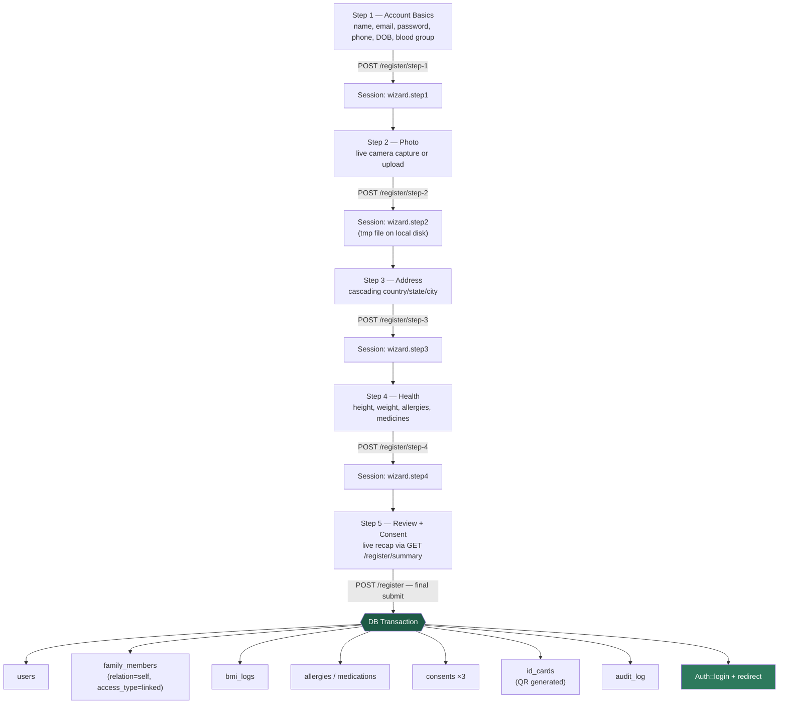
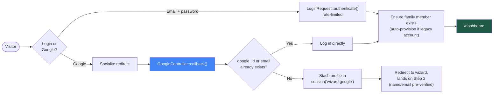
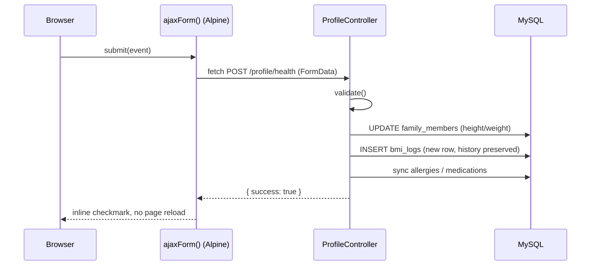
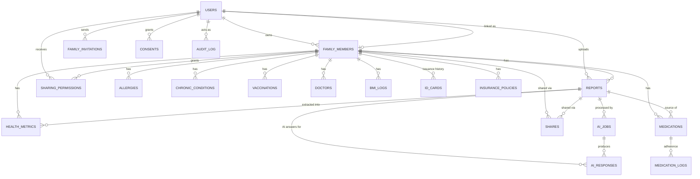

<div align="center">

# 🩺 Novix

### Your family's health records — organized, secure, and explained in plain language.

[](https://laravel.com)
[](https://www.php.net)
[](https://www.mysql.com)
[](https://tailwindcss.com)
[](https://alpinejs.dev)
[](https://vitejs.dev)
[](LICENSE)

[](#-database-schema)
[](#-application-routes)
[](#-roadmap)
[](#-contributing)

</div>

---

## 📑 Table of Contents

- [About](#-about)
- [Features](#-features)
- [Tech Stack](#-tech-stack)
- [Architecture & Pipelines](#-architecture--pipelines)
- [Database Schema](#-database-schema)
- [Project Structure](#-project-structure)
- [Application Routes](#-application-routes)
- [Getting Started](#-getting-started)
- [Security](#-security)
- [Roadmap](#-roadmap)
- [Contributing](#-contributing)
- [License](#-license)

---

## 📖 About

**Novix** is a secure, family-oriented health record manager. It gives a household a single online place to store, understand, and act on every family member's medical history — reports, medications, vitals, allergies, and emergency information — instead of scattered paper files and photos.

Every family member is represented as their own record with two possible modes: a **linked** member who has their own login (the account owner, or anyone they've invited who accepted), or a **dependent** member with no login of their own (a child, an elderly parent) whose records the primary account manages directly.

> ⚠️ **Not a medical device.** Novix organizes and explains records for convenience. It does not diagnose, prescribe, or replace a qualified doctor.

---

## ✨ Features

| | Feature | Description |
|---|---|---|
| 🧙 | **5-Step Animated Registration Wizard** | Session-backed multi-step signup (survives a page refresh) — account basics with live email availability + password strength, live selfie capture via the browser camera, cascading country/state/city address, an animated semi-circular BMI gauge with allergy/medicine tags, and a final review-and-confirm step with required consent capture. |
| 📸 | **Live Camera Capture** | `getUserMedia`-based selfie capture with a face-guide overlay, square crop, client-side JPEG compression, and a file-upload fallback for devices without a camera. |
| 🌍 | **Cascading Location Picker** | Real country → state → city data (India defaulted, full global dataset), lazy-loaded on demand so it never bloats other pages. |
| 📊 | **Live BMI Gauge** | A reusable SVG/CSS speedometer-style gauge (four color zones: underweight, normal, overweight, obese) that animates in real time as height/weight are typed, reused across the wizard, dashboard, and profile. |
| 🔐 | **Google OAuth + Password Auth** | Sign in with Google or email/password. A brand-new Google identity is never turned into a database row until the wizard's final step completes — an abandoned signup leaves no account behind either way. |
| 🏠 | **Family Dashboard** | Hero card with photo/blood group/health ID, live BMI trend, quick-action tiles, a family-member switcher, and honest empty states everywhere (no fabricated data). |
| 🪪 | **Emergency ID Card** | A generated card per family member with a QR code (verification URL + health ID), full issuance history preserved rather than overwritten. |
| 👤 | **Tabbed Profile Editor** | Six independently-saving tabs — Basic Info, Photo, Address, Health, Emergency Contact, Account Security — each with inline success feedback via AJAX, no full-page reloads. |
| 📈 | **BMI History, Not Overwrites** | Editing height/weight from the profile page always inserts a new `bmi_logs` row, preserving trend history instead of destroying it. |
| 🌗 | **Dark Mode** | Toggle persisted server-side per user (`users.theme_preference`), not just in browser storage — follows you across devices. |
| 🗑️ | **Full Account Deletion** | Typed "DELETE" confirmation, then a properly ordered cascade through every dependent table (respecting the schema's deliberate `RESTRICT` constraints on medical records) — a genuine full erasure, not a soft gesture. |
| 🛡️ | **Audit Logging** | Account creation and other sensitive actions are written to an immutable, insert-only `audit_log` table with IP/user-agent capture. |

---

## 🧱 Tech Stack

<div align="center">

| Layer | Technology | Version |
|---|---|---|
| **Language** | PHP | 8.2+ (running 8.4.23) |
| **Backend Framework** | Laravel | 11.54 |
| **Database** | MySQL | 8 / 9 |
| **Auth Scaffolding** | Laravel Breeze (Blade stack) | 2.4 |
| **OAuth** | Laravel Socialite (Google) | 5.28 |
| **QR Codes** | simplesoftwareio/simple-qrcode | 4.2 |
| **Templating** | Blade components | — |
| **Interactivity** | Alpine.js | 3.15 |
| **CSS Framework** | Tailwind CSS + `@tailwindcss/forms` | 3.x |
| **Build Tool** | Vite + laravel-vite-plugin | 6.x |
| **Location Data** | `country-state-city` (lazy-loaded chunk) | 3.2 |
| **Fonts** | Figtree (via Bunny Fonts, GDPR-friendly) | — |
| **Local Dev** | Laravel Herd / `php artisan serve` + DBngin | — |

</div>

**Why this stack:** Laravel's model-level validation (a custom `HasValidation` trait run on every `saving` event) means invalid data can never reach the database even if a caller bypasses form-request validation. Alpine.js keeps every interactive piece — the wizard, the BMI gauge, camera capture, dark mode — dependency-light and framework-free, while Blade components (`x-floating-input`, `x-bmi-gauge`, `x-camera-capture`, `x-location-select`, `x-tag-input`, `x-blood-group-select`, `x-wizard-progress`, `x-dark-mode-toggle`, `x-confetti`) keep the same interactions reusable everywhere they appear.

---

## 🏗️ Architecture & Pipelines

### Registration wizard pipeline

The wizard is **session-backed, not client-state-only**: each step's data is validated and persisted to the server session the moment "Next" is clicked (via `fetch`, no page reload), so refreshing mid-signup resumes exactly where you left off. **Nothing touches the database until step 5 commits** — an abandoned signup never leaves a half-created account.



### Authentication pipeline



### Request → data flow for a profile tab save



---

## 🗄️ Database Schema

**28 tables total** — 20 domain tables + 8 Laravel framework tables (`users` base columns, `cache`, `jobs`, `sessions`, `password_reset_tokens`, `failed_jobs`, `job_batches`, `migrations`). All domain tables use `utf8mb4_unicode_ci` + InnoDB, with foreign keys carrying deliberate, medically-safe `CASCADE` / `RESTRICT` / `SET NULL` rules — for example, `bmi_logs`, `allergies`, and `medications` all `RESTRICT` deletion of their `family_members` row, so routine record edits can never silently destroy medical history (a full account deletion explicitly cascades through these in the correct order instead).

<details>
<summary><b>📊 Entity-Relationship Diagram (click to expand)</b></summary>



</details>

### 1️⃣ Identity & Family Structure

The account graph — a Google/password user, the family members they manage, and the email-invitation flow that upgrades a dependent into an independently-logged-in linked member.

| Table | Purpose | Key columns |
|---|---|---|
| 🟢 `users` | Login accounts | `email` (unique), `google_id` (unique), `password`, `phone`, `avatar_path`, `theme_preference`, two-factor columns |
| 🟢 `family_members` | Every person tracked — self, spouse, kids, parents | `primary_account_id` → users, `linked_user_id` → users (nullable, unique), `unique_health_id` (unique, `NVX-XXXXXXXX`), `relation`, `access_type` (`linked`/`dependent`), `status`, DOB, blood group, height/weight, address, emergency contact — soft-deletes |
| 🟢 `family_invitations` | Email-based invite flow to upgrade a dependent to linked | `token` (unique), `status` (`pending`/`accepted`/`expired`), `expires_at`, `invited_by` |

### 2️⃣ Health Profile

Longitudinal clinical facts not tied to a single report.

| Table | Purpose | Key columns |
|---|---|---|
| 🟡 `allergies` | Known allergies | `allergen_name`, `severity` (`mild`/`moderate`/`severe`), `reaction_description` |
| 🟡 `chronic_conditions` | Ongoing conditions | `condition_name`, `status` (`active`/`managed`/`resolved`) |
| 🟡 `vaccinations` | Immunization history | `vaccine_name`, `dose_number`, `date_administered`, `next_due_date` |
| 🟡 `doctors` | Known doctors | `name`, `specialization`, `hospital_or_clinic_name` |

### 3️⃣ Reports, Vitals & AI Processing

Uploaded documents (full-text searchable), structured vitals, and the async AI summarization pipeline with a full answer-history table.

| Table | Purpose | Key columns |
|---|---|---|
| 🔵 `reports` | Uploaded documents | `type` (blood_test/prescription/xray/mri_ct/insurance/bill/ecg/other), `ocr_text` (FULLTEXT indexed), `ocr_status`, `ai_summary` (cache of latest), `is_archived` — soft-deletes |
| 🔵 `bmi_logs` | BMI history over time | `height_cm`, `weight_kg`, `bmi_value` (auto-computed), `bmi_category` (auto-computed), `recorded_date`, `source` (`manual`/`report_extracted`) |
| 🔵 `health_metrics` | Extracted vitals (BP, sugar, cholesterol, HbA1c, hemoglobin...) | `metric_type`, `value`, `unit`, `recorded_date`, `source` |
| 🔵 `ai_jobs` | Async AI job queue/quota tracking | `job_type` (ocr/summary/translation/entity_extraction), `status`, `input_tokens`, `output_tokens` |
| 🔵 `ai_responses` | **Permanent history** of every AI answer — not just the latest | `response_type`, `content`, `language`, `provider` |

### 4️⃣ Medications

| Table | Purpose | Key columns |
|---|---|---|
| 🟣 `medications` | Active/past prescriptions | `medicine_name`, `dosage`, `frequency`, `schedule_times` (JSON array), `active` |
| 🟣 `medication_logs` | Per-dose adherence log | `scheduled_at`, `taken_at`, `status` (`taken`/`missed`/`skipped`) |

### 5️⃣ Sharing, Identity Cards & Compliance

| Table | Purpose | Key columns |
|---|---|---|
| 🔴 `shares` | Time-boxed external share links | `token` (unique), `access_type` (single_report/full_summary/emergency_card), `expires_at`, `revoked_at`, `view_count` |
| 🔴 `id_cards` | Emergency ID cards — **full issuance history preserved**, never overwritten | `card_number` (unique), `photo_path` (snapshot at issue time), `qr_code_path`, `is_active` |
| 🔴 `consents` | Legal/compliance consent capture | `consent_type` (upload/ai_processing/sharing/account_creation), `ip_address`, `user_agent` |
| 🔴 `audit_log` | **Immutable**, insert-only action trail | `action`, `target_type`, `target_id`, `ip_address` — no `updated_at` by design |
| 🔴 `sharing_permissions` | A linked member's explicit, revocable grant of view access | Composite unique (`family_member_id`, `granted_to_user_id`), `scope`, `revoked_at` |
| 🔴 `insurance_policies` | Insurance policy tracking | `provider_name`, `policy_number`, `coverage_amount`, `expiry_date` |

---

## 📁 Project Structure

```
novix/
├── app/
│   ├── Http/Controllers/
│   │   ├── Auth/                    # Login, Google OAuth, registration wizard
│   │   ├── DashboardController.php
│   │   ├── IdCardController.php
│   │   └── ProfileController.php
│   ├── Http/Requests/Registration/  # Per-step wizard validation
│   ├── Models/
│   │   ├── Concerns/HasValidation.php   # Model-level validation trait
│   │   └── *.php                        # 20 domain models
│   └── Policies/
├── database/migrations/             # 24 sequential migrations
├── resources/
│   ├── js/
│   │   ├── alpine/                  # registration-wizard, camera-capture,
│   │   │                            #   bmi-gauge, location-select, tag-input,
│   │   │                            #   blood-group-select, password-strength,
│   │   │                            #   dark-mode, ajax-form
│   │   └── app.js                   # Registers all Alpine.data components
│   └── views/
│       ├── auth/wizard/             # 5 step partials
│       ├── components/              # Reusable x-* Blade components
│       ├── profile/tabs/            # 6 profile tabs
│       └── dashboard.blade.php
└── routes/
    ├── web.php
    └── auth.php
```

---

## 🌐 Application Routes

<details>
<summary><b>39 routes — click to expand full list</b></summary>

| Method | URI | Name | Purpose |
|---|---|---|---|
| GET | `/` | — | Landing page |
| GET | `/register` | `register` | Wizard shell (resumes at furthest step) |
| GET | `/register/check-email` | `register.check-email` | Debounced email availability check |
| GET | `/register/photo-preview` | `register.photo-preview` | Session-scoped tmp photo preview |
| GET | `/register/summary` | `register.summary` | Live JSON snapshot for Step 5's review cards |
| POST | `/register/step-{1..4}` | `register.step{1..4}` | Per-step session save |
| POST | `/register` | `register.complete` | Final DB transaction |
| GET/POST | `/login` | `login` | Email/password login |
| GET/POST | `/auth/google/redirect`, `/auth/google/callback` | `auth.google.*` | Google OAuth |
| POST | `/logout` | `logout` | — |
| GET/POST | `/forgot-password`, `/reset-password` | `password.*` | Password reset flow |
| GET | `/dashboard` | `dashboard` | Hero, BMI gauge, quick actions, family switcher |
| POST | `/dashboard/switch/{familyMember}` | `dashboard.switch` | Switch active profile |
| GET | `/id-card` | `id-card.show` | Emergency ID card + QR |
| GET | `/profile` | `profile.edit` | Tabbed profile editor |
| POST | `/profile/{basic-info,photo,address,health,emergency-contact}` | `profile.*` | Per-tab AJAX save |
| PATCH | `/profile/theme` | `profile.theme` | Dark mode persistence |
| PUT | `/password` | `password.update` | Change password |
| DELETE | `/profile` | `profile.destroy` | Full account deletion (typed confirmation) |
| GET | `/reports/upload`, `/timeline`, `/share` | — | Placeholder pages (not yet built) |

</details>

---

## 🚀 Getting Started

### Prerequisites

- PHP 8.2+ with Composer
- MySQL 8/9 (via [DBngin](https://dbngin.com), Laravel Herd, or any local install)
- Node.js + npm
- A [Google OAuth client ID/secret](https://console.cloud.google.com) (optional, for Google sign-in)

### Installation

```bash
git clone https://github.com/neevmodh/Novix.git
cd Novix

# Install dependencies
composer install
npm install

# Configure environment
cp .env.example .env
php artisan key:generate

# Point .env at your database, then:
php artisan migrate
php artisan storage:link

# Build front-end assets
npm run build
```

Add your Google OAuth credentials to `.env`:

```dotenv
GOOGLE_CLIENT_ID=your-google-oauth-client-id
GOOGLE_CLIENT_SECRET=your-google-oauth-client-secret
GOOGLE_REDIRECT_URI=http://localhost:8000/auth/google/callback
```

Run the app:

```bash
php artisan serve
```

Then visit **http://localhost:8000** 🎉

---

## 🔒 Security

- Model-level validation (`HasValidation` trait) runs on every `saving` event — invalid data can never reach the database even if a caller bypasses form-request validation.
- Every route touching family data verifies record ownership against the logged-in user.
- Foreign keys use deliberate, medically-safe cascade rules — `RESTRICT` on tables that hold real medical history (`bmi_logs`, `allergies`, `medications`, `reports`...), so routine edits can never silently wipe it.
- A brand-new Google identity is never written to `users` until registration fully completes — no half-created accounts from an abandoned signup, via either auth path.
- Account creation, and other sensitive actions, are written to an append-only `audit_log` with IP/user-agent capture.
- Full account deletion requires a typed "DELETE" confirmation plus current-password re-entry, and explicitly cascades through every dependent table in the correct order.
- 2FA columns (`two_factor_secret`, `two_factor_recovery_codes`) are stored `encrypted`/`encrypted:array` at the Eloquent cast level.

Found a vulnerability? Please open a private security advisory rather than a public issue.

---

## 🗺️ Roadmap

- [x] Full database schema (28 tables, normalized, FK-audited)
- [x] Session-backed multi-step registration wizard
- [x] Google OAuth + email/password auth
- [x] Family dashboard with live BMI gauge
- [x] Tabbed profile editor
- [x] Emergency ID card with QR generation
- [x] Dark mode (server-persisted)
- [ ] Report upload + OCR pipeline
- [ ] AI report summarization (Gemini)
- [ ] Health timeline
- [ ] Secure report sharing links
- [ ] Family invitation UI (backend already supports linked/dependent modes)
- [ ] Medicine reminder scheduling

---

## 🤝 Contributing

Contributions, issues, and feature requests are welcome!

1. Fork the repo
2. Create your feature branch (`git checkout -b feature/amazing-feature`)
3. Commit your changes (`git commit -m 'Add some amazing feature'`)
4. Push to the branch (`git push origin feature/amazing-feature`)
5. Open a Pull Request

---

## 📄 License

Distributed under the **Apache License 2.0**. See [`LICENSE`](LICENSE) for details.

---

<div align="center">

Made with ❤️ for families everywhere.

</div>
